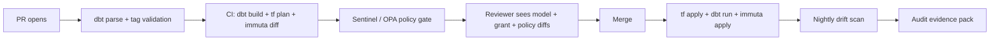

> Part of the [Data Platform Protection survey](/posts/2026/05/13/data-platform-protection-survey/).
> Sibling deep-dives:
> [BigQuery](/posts/2026/05/13/bigquery-data-protection/) ·
> [Databricks Unity Catalog](/posts/2026/05/13/databricks-unity-catalog-data-protection/) ·
> [Policy overlay vendors](/posts/2026/05/13/data-policy-overlay-vendors/) ·
> [The third-party auditor's gap list](/posts/2026/05/13/data-platform-auditor-gaps/)

<!-- WRITING PROMPT — opener:
   - Set up: every previous post in this series describes controls. This post is about *who applies the controls and how*.
   - The argument: if your access policy is hand-clicked in a console, it drifts within weeks. Auditors notice.
   - Frame the two-layer pattern: dbt for what's bound to the data model (grants, classification meta), Terraform for what's bound to the platform (ABAC policies, masking policies, network rules, key bindings).
   - Tone: prescriptive, like the AI rubrics post.
-->

## Why governance drifts without IaC

<!-- PROMPT:
   - The drift modes:
     - A new table is created without a tag → ABAC doesn't catch it.
     - A grant is added in the console for a one-off → never removed.
     - A masking policy is changed in dev → never promoted to prod.
     - An auditor asks "show me the diff between policy intent and reality on Jan 14" → nobody can answer.
   - The fix has two halves: declarative source of truth + drift detection.
-->

## The dbt layer

<!-- PROMPT:
   - dbt's value here: dbt already runs as the thing creating tables. Bolting governance onto the same flow is cheap.
   - Two main mechanisms: `grants` config (privileges) and `meta` (classification + ownership).
   - Plus model contracts in dbt Mesh (data contracts as governance).
-->

### 1. The `grants` config

<!-- PROMPT:
   - `grants:` block on a model declares the privileges that should exist after the model runs.
   - dbt reconciles on every run — drift is fixed automatically.
   - Anti-pattern: granting on individual tables instead of group-level grants on schemas.
   - Cite: dbt grants [1].
-->

### 2. `meta` for PII / sensitivity tagging

<!-- PROMPT:
   - `meta:` is arbitrary, but the convention is to tag columns with PII / sensitivity classifications.
   - Downstream consumer: a Terraform-generating script reads dbt's `manifest.json` and emits the classification mappings.
   - The pattern that beats hand-tagging: dbt PR review = classification review. The same diff that adds a column says "this column is PII".
   - Cite: dbt `meta` [2].
-->

### 3. dbt Mesh contracts

<!-- PROMPT:
   - Contracts enforce schema (column names, types, nullability, constraints) on published models.
   - Why this is governance: a contract violation means downstream consumers can't be silently broken — and a tagged column can't be silently retyped to lose its tag.
   - Cite: model contracts [3], governance overview [4].
-->

### 4. dbt Cloud RBAC and audit logs

<!-- PROMPT:
   - The "who deployed what when" answer for the dbt layer itself.
   - Required for SOC 2 — dbt Cloud is in the production data path.
   - Cite: Cloud audit log [5], Cloud enterprise permissions [6].
-->

### 5. Snowflake masking via dbt: the `dbt-snow-mask` pattern

<!-- PROMPT:
   - The community pattern that bridges classification (in dbt `meta`) to masking policy DDL.
   - Pattern: `meta.pii: true` → macro emits `ALTER TABLE ... MODIFY COLUMN ... SET MASKING POLICY` after the model materializes.
   - Caveat: covered here as illustrative; details for the Snowflake-specific deep dive (separate post).
   - Cite: dbt-snow-mask [7].
-->

## The Terraform layer

<!-- PROMPT:
   - dbt covers the data model. Terraform covers the platform: catalogs, ABAC policies, masking policies, network rules, key bindings.
   - The clean split: if the resource exists outside the SQL `CREATE` flow, it belongs in Terraform.
-->

### 6. Databricks Unity Catalog via the `databricks` provider

<!-- PROMPT:
   - Resources to know:
     - `databricks_catalog`, `databricks_schema` — the namespace.
     - `databricks_grants` — the privileges.
     - `databricks_policy_info` — ABAC policies with `POLICY_TYPE_COLUMN_MASK` / `POLICY_TYPE_ROW_FILTER`.
   - The full UC governance surface is Terraform-addressable today.
   - Cite: grants [8], catalogs [9], policy_info [10].
-->

### 7. BigQuery via the `google` provider

<!-- PROMPT:
   - Resources to know:
     - `google_data_catalog_policy_tag` — define the taxonomy.
     - `google_bigquery_datapolicy_data_policy` — masking + CLS attached to tags.
     - `google_bigquery_dataset_iam_*` — dataset-level IAM bindings.
   - The pattern: classification taxonomy in Terraform, dbt models annotate which columns wear which tag, a build step joins them.
   - Cite: BigQuery dataset IAM [11], data policy [12], policy tag [13].
-->

### 8. AWS Lake Formation via the `aws` provider

<!-- PROMPT:
   - Resources to know:
     - `aws_lakeformation_lf_tag` — define LF-Tag keys/values.
     - `aws_lakeformation_permissions` — grant on catalog / database / table / LF-tag expressions.
   - Pattern is identical to BigQuery: tag taxonomy in Terraform, application annotates resources with tags via Glue API or table properties.
   - Cite: LF permissions [14], LF tag [15].
-->

### 9. Sentinel and OPA: gating policy-as-code in PR review

<!-- PROMPT:
   - The point: Terraform can apply *anything*. The risk is reviewers missing a policy regression.
   - Sentinel (Terraform Cloud / Enterprise) and OPA / conftest (open) gate plans against policies like:
     - "No grant of `MANAGE` privilege to a non-admin group."
     - "No masking policy that maps PII tag to no-op transform."
     - "No public IP allowlist entry."
   - Cite: HashiCorp policy-as-code phase [16].
-->

### 10. The Immuta-no-Terraform-provider gap

<!-- PROMPT:
   - There is no first-party Immuta Terraform provider in the public registry.
   - The workaround pattern: Immuta V2 REST API + a CI job (often Python or `terraform_data` blocks calling out via `null_resource` / `external` data source).
   - Implication: drift detection is *not* automatic — your CI has to read live state and diff against your YAML/JSON policy files.
   - This is a real risk for SOC 2 evidence ("how did you know the policy in prod matched what was reviewed?").
   - Caveat: there is an Immuta-published Terraform module for Snowflake scaffolding — different scope, not policy management.
-->

## A reference pipeline shape

<!-- PROMPT:
   - End-to-end sketch:
     1. PR opens with dbt model + classification meta change.
     2. Pre-commit: dbt parse + tag schema validation.
     3. CI: dbt build (dev), Terraform plan (dev), Sentinel/OPA gate, Immuta API plan diff.
     4. Reviewer sees: data model diff + grant diff + policy diff in one PR.
     5. Merge → CI: terraform apply → dbt run → Immuta API apply → drift report attached to artifact.
     6. Nightly: drift scan reads live state, diffs against repo, opens an issue if it differs.
   - Optional ASCII / mermaid of this flow.
-->

## What good looks like

<!-- PROMPT — opinionated bullets:
   - Two repos at most: one for data models (dbt) and one for platform (Terraform). Sometimes one monorepo.
   - All grants reconcile on every dbt run.
   - All ABAC / masking / row-filter policies in Terraform plans.
   - Classification metadata flows from dbt `meta` to platform tags via a build-time generator.
   - Drift detection runs nightly and the result is part of your control-evidence pack.
   - No console clicks in production except as break-glass with audited approval.
-->

---

## Sources

### dbt
1. dbt grants config — <https://docs.getdbt.com/reference/resource-configs/grants>
2. dbt `meta` resource property — <https://docs.getdbt.com/reference/resource-properties/meta>
3. dbt model contracts — <https://docs.getdbt.com/docs/mesh/govern/model-contracts>
4. dbt Mesh governance overview — <https://docs.getdbt.com/docs/mesh/govern/about-model-governance>
5. dbt Cloud audit log — <https://docs.getdbt.com/docs/cloud/manage-access/audit-log>
6. dbt Cloud enterprise permissions / RBAC — <https://docs.getdbt.com/docs/platform/manage-access/enterprise-permissions>
7. dbt-snow-mask community package — <https://github.com/entechlog/dbt-snow-mask>

### Terraform providers
8. Databricks UC grants resource — <https://registry.terraform.io/providers/databricks/databricks/latest/docs/resources/grants>
9. Databricks UC catalog resource — <https://registry.terraform.io/providers/databricks/databricks/latest/docs/resources/catalog>
10. Databricks UC ABAC `policy_info` — <https://registry.terraform.io/providers/databricks/databricks/latest/docs/resources/policy_info>
11. Google BigQuery dataset IAM — <https://registry.terraform.io/providers/hashicorp/google/latest/docs/resources/bigquery_dataset_iam>
12. Google BigQuery data policy — <https://registry.terraform.io/providers/hashicorp/google/latest/docs/resources/bigquery_datapolicy_data_policy>
13. Google Data Catalog policy tag — <https://registry.terraform.io/providers/hashicorp/google/latest/docs/resources/data_catalog_policy_tag>
14. AWS Lake Formation permissions — <https://registry.terraform.io/providers/hashicorp/aws/latest/docs/resources/lakeformation_permissions>
15. AWS Lake Formation LF-Tag — <https://registry.terraform.io/providers/hashicorp/aws/latest/docs/resources/lakeformation_lf_tag>

### Policy-as-code
16. Terraform governance phase (Sentinel / OPA) — <https://developer.hashicorp.com/terraform/intro/phases/govern>

### Adjacent reading
17. dbt Labs — automating data classification — <https://www.getdbt.com/blog/automating-data-classification-for-the-21st-century>
18. dbt Labs — federated data governance — <https://www.getdbt.com/blog/federated-data-governance>
19. Immuta V2 API (the no-Terraform-provider workaround) — <https://documentation.immuta.com/latest/developer-guides/api-intro/>
20. Practitioner walkthrough: dbt + Terraform + Dataplex policy tags — <https://dev.to/ipt/data-governance-with-dbt-terraform-and-dataplex-a-practical-guide-to-bigquery-policy-tags-5f7d>

<!-- VERIFY-AT-PUBLISH:
   - Immuta provider availability — check the Terraform Registry at publish time in case Immuta has shipped one.
   - dbt Mesh / contracts API surface — moves with dbt-core releases.
-->
