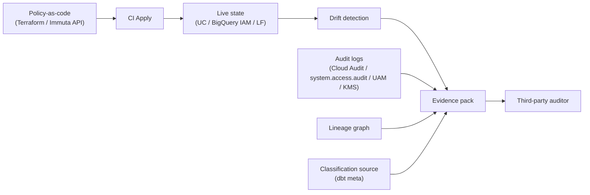

> Part of the overview: [How Modern Data Platforms Protect Data](/posts/2026/05/13/how-modern-data-platforms-protect-data/).
> Sibling deep-dives:
> [BigQuery](/posts/2026/05/13/bigquery-data-protection/) ·
> [Databricks Unity Catalog](/posts/2026/05/13/databricks-unity-catalog-data-protection/) ·
> [Policy overlay vendors](/posts/2026/05/13/data-policy-overlay-vendors/) ·
> [Governance-as-code with dbt + Terraform](/posts/2026/05/13/data-governance-as-code-dbt-terraform/)

<!-- WRITING PROMPT — opener:
   - Frame: every platform in this series ships strong building blocks. Most audit findings aren't about missing features — they're about how those features get assembled, evidenced, and operated.
   - State the perspective: pretend you're a Big-4 SOC 2 / ISO 27701 auditor sitting across the table. What would you ask?
   - Tone: direct, opinionated, the same voice as the rest of the series.
-->

## What an auditor actually looks for

<!-- PROMPT:
   - It's not "do you have masking" — it's:
     1. Is the control designed to address a stated risk? (design gap)
     2. Is the control implemented as designed? (implementation gap)
     3. Is the control operating effectively over the audit period? (operating gap)
   - Most platform engineers think about (1) and (2). Auditors fail you on (3).
   - The recurring evidence asks: "show me the policy that was in effect on date X for table Y" and "show me who could read column Z on date X".
-->

## The control families auditors map to

<!-- PROMPT:
   - Brief tour of the frameworks and where they touch data platforms:
     - AICPA TSC (SOC 2): Security (CC), Confidentiality (C), Privacy (P) categories — most data findings live in CC6 (logical access) and CC7 (system operations).
     - ISO 27001:2022 Annex A: A.5.15 access control, A.5.34 privacy, A.8.11 data masking, A.8.12 data leakage prevention.
     - ISO 27701:2025 PIMS extension: data subject rights, lawful basis, retention.
     - HIPAA Security Rule (45 CFR 164 Subpart C): access control 164.312(a), audit controls 164.312(b), integrity 164.312(c).
     - PCI DSS v4: Req 3 (protect stored data), Req 7 (least privilege), Req 8 (identification + auth), Req 10 (logging + monitoring).
     - GDPR Art. 25 (privacy by design), Art. 32 (security of processing), Art. 35 (DPIA).
     - NIST 800-53 Rev. 5: AC (access control), AU (audit), SC (system + comms protection) families.
     - NIST Privacy Framework Core: Identify-P, Govern-P, Control-P, Communicate-P, Protect-P.
     - CSA CCM v4: maps cloud controls cleanly to many of the above.
   - Cite: AICPA TSC [1], ISO 27001 [2], ISO 27701 [3], HIPAA Security Rule [4], PCI DSS [5], GDPR [6], NIST 800-53r5 [7], NIST Privacy Framework [8], CSA CCM v4 [10].
-->

## The gap catalog

<!-- PROMPT — this is the meaty section. Each gap gets:
   - Symptom (what an auditor will see)
   - Root cause (why it happens on these platforms)
   - Frameworks it lights up
   - Fix sketch
-->

### Gap 1: Service account and shared-credential sprawl

<!-- PROMPT:
   - Symptom: dozens of service accounts with broad reads, shared across pipelines, no rotation cadence, no clear owner.
   - Root cause: scheduled queries / Dataform / Composer / dbt Cloud / external connectors each spawn their own SA without a registry.
   - Frameworks: SOC 2 CC6.1, CC6.2; ISO A.5.15; HIPAA 164.312(a)(2)(i); PCI Req 8.6; NIST AC-2.
   - Fix: SA registry as a Terraform module; max-age via key rotation; per-pipeline SA naming convention; quarterly access reviews exported as evidence.
-->

### Gap 2: Lineage gaps for derived, ML, and feature tables

<!-- PROMPT:
   - Symptom: a downstream table contains PII, but lineage doesn't connect it to the source — you can't prove the source policy carried through.
   - Root cause: lineage capture is uneven (UC captures in-scope compute; outside that, dark; BigQuery lineage on Dataflow / Dataform partial; ML feature pipelines often invisible).
   - Frameworks: GDPR Art. 25; NIST Privacy Framework Govern-P; SOC 2 C1.1.
   - Fix: OpenLineage emitters in every pipeline runner; column-level lineage as a hard requirement, not nice-to-have; lineage coverage dashboard reviewed quarterly.
-->

### Gap 3: Inconsistent classification across catalogs and overlays

<!-- PROMPT:
   - Symptom: same logical column tagged "PII" in dbt `meta`, "confidential" in BigQuery policy taxonomy, untagged in Immuta. Policies disagree on the column's sensitivity.
   - Root cause: classification authored in multiple places without a single source of truth.
   - Frameworks: ISO 27001 A.5.12 (classification); SOC 2 C1.1; NIST Privacy Framework Identify-P.
   - Fix: declare classification in dbt `meta` once; build-time generators emit the same tags into native catalog + overlay; reconcile job alerts on drift.
-->

### Gap 4: Policy-as-code vs live-state drift

<!-- PROMPT:
   - Symptom: the policy YAML in the repo doesn't match the policy in production.
   - Root cause: console clicks during incidents; partial Terraform applies; Immuta API changes outside CI.
   - Frameworks: SOC 2 CC8.1 (change management); NIST CM-3; PCI Req 6.4.
   - Fix: nightly drift scan reads live state, diffs, opens an issue; "no console clicks" enforced via IAM (read-only roles for humans in prod); break-glass with audit trail.
-->

### Gap 5: BYOK / HYOK key custody and rotation evidence

<!-- PROMPT:
   - Symptom: CMEK is configured, but you can't produce a key rotation log or prove who has decrypt rights at a point in time.
   - Root cause: KMS audit logs aren't captured the same way as warehouse audit logs; key admin role granted broadly.
   - Frameworks: SOC 2 CC6.1, CC6.7; PCI Req 3.6, 3.7; HIPAA 164.312(a)(2)(iv); ISO A.8.24.
   - Fix: KMS audit logs into the same evidence pipeline; key admin = a single SA owned by a single team; rotation cadence in policy; EKM where regulators demand external custody.
-->

### Gap 6: Data residency in multi-region and federated query paths

<!-- PROMPT:
   - Symptom: a query joins a US dataset to an EU dataset; you can't prove the data didn't traverse the wrong region.
   - Root cause: BigQuery cross-region copies, Lakehouse Federation, Lake Formation cross-account share, all create implicit data movement.
   - Frameworks: GDPR Art. 44-49 (transfers); industry-specific data residency rules.
   - Fix: VPC-SC perimeters per region; per-region metastores / projects; no cross-region queries in production except via reviewed federation; data movement events in audit trail.
-->

### Gap 7: DSAR and right-to-be-forgotten on Iceberg / Delta append-only stores

<!-- PROMPT:
   - Symptom: a deletion request comes in. Production tables are Iceberg / Delta. Snapshots still contain the row for retention period. You delete from current state but old snapshots are addressable.
   - Root cause: open table formats are append-only by design; row-level deletion is a logical operation, not physical.
   - Frameworks: GDPR Art. 17; CCPA/CPRA; HIPAA right of amendment.
   - Fix: documented retention + snapshot-expiration cadence; physical deletion + VACUUM as part of the DSAR runbook; evidence pack with snapshot expiration logs.
   - Cite: IAPP DSAR pieces [11], [12].
-->

### Gap 8: Third-party / sub-processor sharing

<!-- PROMPT:
   - Symptom: Delta Sharing recipient list / Analytics Hub listings / Lake Formation cross-account grants exist with no record of the data-processing agreement (DPA) or sub-processor disclosure.
   - Root cause: sharing is a self-serve operation; legal isn't in the loop.
   - Frameworks: GDPR Art. 28; ISO 27701 PIMS sub-processor controls; SOC 2 CC9.2.
   - Fix: every sharing grant requires a ticket linking to a DPA; quarterly reconciliation of recipient list to vendor management registry; expiration on every share by default.
-->

### Gap 9: AI / ML training data lineage and provenance

<!-- PROMPT:
   - Symptom: a model card says "trained on customer data" but you can't enumerate which tables, snapshots, or filtered subsets.
   - Root cause: feature engineering steps aren't lineage-emitting; training jobs read from notebooks without manifest capture.
   - Frameworks: NIST Privacy Framework Communicate-P; GDPR Art. 22 (automated decisions); emerging EU AI Act obligations.
   - Fix: training datasets materialized as versioned tables (Delta / Iceberg snapshots); training job emits a manifest pointing at exact snapshots; model registry references the manifest.
-->

### Gap 10: Control-evidence collection at scale

<!-- PROMPT:
   - Symptom: it takes the security team three weeks to assemble the evidence pack for the audit.
   - Root cause: audit data lives in N places (Cloud Audit Logs, `system.access.audit`, Lake Formation events, Immuta UAM, KMS logs, Terraform Cloud audit, dbt Cloud audit) without a normalized shape.
   - Frameworks: SOC 2 CC4.1, CC7.2; ISO A.8.15; PCI Req 10.4.
   - Fix: stream all audit sources into one warehouse table with a normalized schema; pre-build the queries the auditor asks ("who could read X on Y", "what changed in policy P between dates A and B"); rehearse the evidence ask quarterly.
   - Cite: KPMG / PwC / EY thought leadership [13]–[16].
-->

## A defensible reference architecture

<!-- PROMPT:
   - Synthesize: what does "audit-ready" look like end-to-end?
   - Bullet list:
     - Single source of truth for classification (dbt `meta`).
     - All grants + ABAC + masking applied via IaC, gated by Sentinel/OPA.
     - Lineage column-level, captured by OpenLineage everywhere.
     - Audit logs streamed to a single normalized warehouse table.
     - KMS audit on equal footing with warehouse audit.
     - Per-region perimeters; cross-region paths reviewed.
     - Sharing requires DPA reference + expiration default.
     - Training jobs emit manifests pointing at snapshot IDs.
     - Quarterly evidence-pack rehearsal.
-->

## The audit evidence flow

## Closing

<!-- PROMPT — a few sentences:
   - The platforms are not the problem. Operations is the problem.
   - The teams that pass clean don't have more features than the ones that fail. They have evidence loops.
   - Build the evidence loop first; the controls you need will become obvious.
-->

---

## Sources

### Standards and statutes (primary)
1. AICPA Trust Services Criteria — <https://us.aicpa.org/content/dam/aicpa/interestareas/frc/assuranceadvisoryservices/downloadabledocuments/trust-services-criteria.pdf>
2. ISO/IEC 27001:2022 — <https://www.iso.org/standard/27001>
3. ISO/IEC 27701:2025 (PIMS) — <https://www.iso.org/standard/27701>
4. HIPAA Security Rule (45 CFR Part 164 Subpart C) — <https://www.ecfr.gov/current/title-45/subtitle-A/subchapter-E/part-164/subpart-C>
5. PCI DSS document library (v4.x) — <https://www.pcisecuritystandards.org/document_library>
6. GDPR (Regulation EU 2016/679) — <https://eur-lex.europa.eu/legal-content/EN/TXT/?uri=CELEX:32016R0679>
7. NIST SP 800-53 Rev. 5 — <https://doi.org/10.6028/NIST.SP.800-53r5>
8. NIST Privacy Framework — <https://www.nist.gov/privacy-framework>
9. California CCPA / CPRA — <https://leginfo.legislature.ca.gov/faces/codes_displayText.xhtml?lawCode=CIV&division=3.&part=4.&title=1.81.5.&chapter=&article=>
10. CSA Cloud Controls Matrix v4 — <https://cloudsecurityalliance.org/artifacts/cloud-controls-matrix-v4>

### Practitioner / industry
11. IAPP — operationalizing GDPR DSARs — <https://iapp.org/news/a/considerations-for-operationalizing-data-subject-rights-under-gdpr>
12. IAPP — DSARs at warehouse scale — <https://iapp.org/resources/article/solving-dsars-big-data-problem>
13. KPMG — multicloud security & data governance — <https://kpmg.com/us/en/articles/2024/framework-success-tackling-challenges-multicloud-security.html>
14. PwC — cloud governance, risks, and controls — <https://www.pwc.com/us/en/tech-effect/cloud/cloud-governance-on-risks-and-controls.html>
15. EY — Data migration and the AI Data Cloud (PDF) — <https://www.ey.com/content/dam/ey-unified-site/ey-com/en-gl/alliances/documents/ey-gl-data-migration-platform-with-snowflake-ai-data-cloud-08-25.pdf>
16. Deloitte — Chief Data Officer Survey 2025 — <https://www.deloitte.com/nl/en/services/consulting-risk/research/chief-data-officer-survey-2025.html>
17. EDPB — GDPR Article 35 (DPIA) — <https://www.edpb.europa.eu/gdpr-articles/article-35-data-protection-impact-assessment_en>
18. Forrester Wave: Data Governance Solutions Q3 2025 — <https://www.forrester.com/blogs/the-forrester-wave-data-governance-solutions-q3-2025-shows-that-governance-has-entered-the-agentic-era>
19. Gartner — Data Security Platforms market — <https://www.gartner.com/reviews/market/data-security-platforms>
20. ISACA — Rethinking data governance — <https://www.isaca.org/resources/white-papers/rethinking-data-governance-and-management>

<!-- VERIFY-AT-PUBLISH:
   - PCI DSS version (5 should be in flight by some publish dates).
   - ISO 27701:2025 — verify it stays the current edition.
-->
