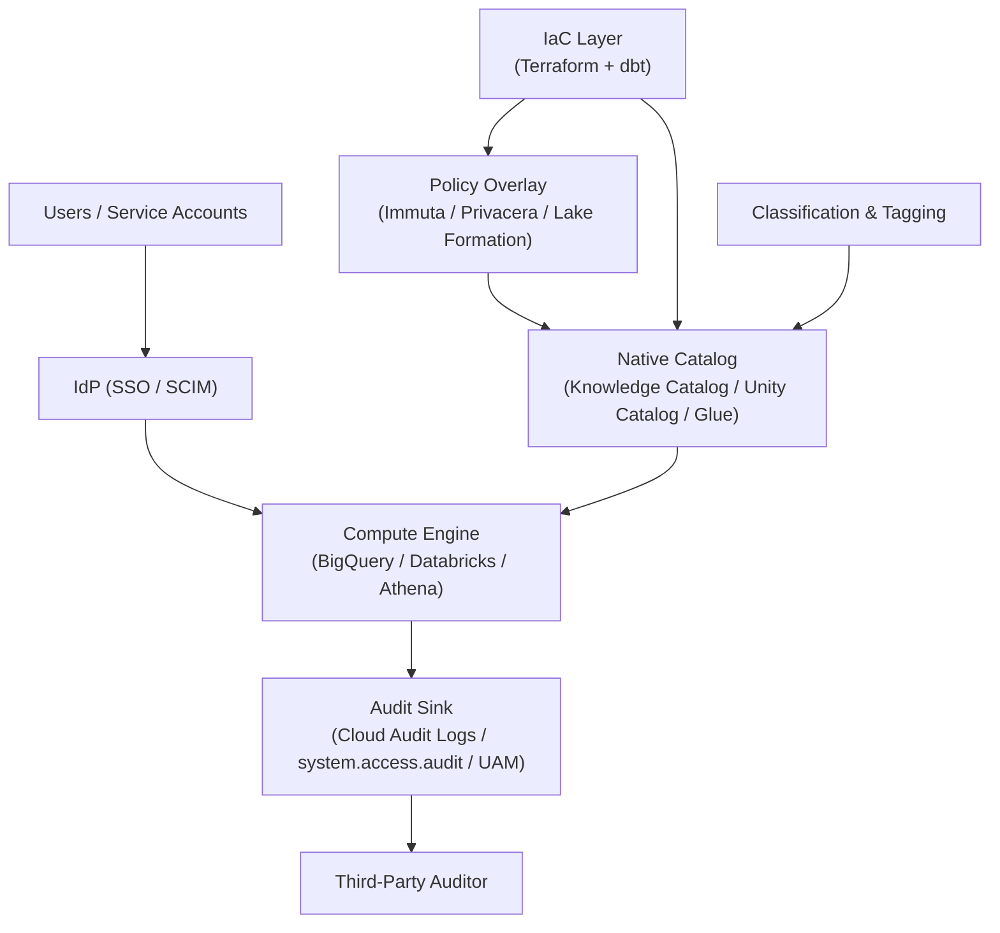

Every cloud data warehouse pitch deck claims "enterprise-grade governance." Read the docs and you find the same ten or so building blocks, assembled differently. The interesting question isn't *which platform has the most boxes checked* — it's whether the controls actually fire end to end when a query runs, and whether you can prove it.

This is a survey, not a tutorial. I walk the request path a query takes through a modern data platform, line up the ten control areas against it, then compare how BigQuery, Databricks Unity Catalog, the policy-overlay vendors (Immuta, Privacera, OneTrust, Lake Formation), and the dbt + Terraform IaC layer implement each one. The deep-dives go further on each platform. The point of this post is the shared lens — and the verification questions you ask at every step.

Snowflake gets its own series. It is intentionally not here.

> **The series:**
> - [Data protection in BigQuery](/posts/2026/05/13/bigquery-data-protection/)
> - [Data protection in Databricks Unity Catalog](/posts/2026/05/13/databricks-unity-catalog-data-protection/)
> - [Data policy overlay vendors: Immuta, Privacera, OneTrust, Lake Formation](/posts/2026/05/13/data-policy-overlay-vendors/)
> - [Data governance as code: dbt + Terraform patterns](/posts/2026/05/13/data-governance-as-code-dbt-terraform/)
> - [Where the auditor will find gaps in your data platform](/posts/2026/05/13/data-platform-auditor-gaps/)

## What "data protection" means in this survey

Six properties. A platform is "protecting data" only if it can defend each one in front of an auditor:

- **Confidentiality** — the wrong principal cannot read the wrong bytes.
- **Integrity** — the bytes are what the writer wrote.
- **Availability** — the data is reachable to the right principals when the SLA says so.
- **Privacy** — personal data is minimized, masked, or transformed before it leaves the perimeter.
- **Auditability** — every access decision is logged in a way a third party can reconstruct.
- **Lineage and residency** — you know where each byte came from and which jurisdiction it lives in.

Out of scope here: physical security, generic corporate IAM hygiene, app-layer encryption inside the calling service. The lens is the warehouse: when a query runs, what stops the wrong data from coming back, and how do you prove the control fired?

## The end-to-end request path

A query is the natural unit of analysis because every control either fires on the request path or it does not exist. The path looks roughly the same on every platform:

1. **Identity resolves.** The IdP issues a token; SCIM has already provisioned groups.
2. **Coarse authorization.** IAM (or the catalog's equivalent) decides if the principal can even reach the object.
3. **Fine-grained authorization.** Row, column, and tag-based policies filter what is visible.
4. **Transformation.** Masking, tokenization, and aggregation rules rewrite the result before it leaves the engine.
5. **Egress controls.** Network perimeter, sharing rules, and residency rules decide where the bytes can land.
6. **Audit emission.** An immutable record of who-asked-what-and-saw-what is written to a sink.

If a control is not on this list, it is not protecting the query — it is supporting evidence (key custody, classification scans, lineage capture) that makes the controls on this list trustworthy.

The verification question at every step is the same: **show me the log line.** A control that cannot produce a queryable audit record is folklore.

## A common control taxonomy

The ten control areas every platform in this survey claims, ordered roughly by where they hit the request path:

1. **Identity and coarse access** — IAM, project/workspace boundaries.
2. **Fine-grained access** — table, column, row, view.
3. **Masking and tokenization** — dynamic, format-preserving, k-anonymity.
4. **Classification and tagging** — the input ABAC and masking actually consume.
5. **Lineage** — upstream and downstream, including derived and ML feature tables.
6. **Audit and observability** — the only proof the other nine fired.
7. **Encryption and key custody** — CMEK, EKM, AEAD, two-key models.
8. **Network isolation** — perimeters, private endpoints, egress rules.
9. **Data sharing** — cross-account, cross-org, external.
10. **Residency and sovereignty** — region pinning, dual-region behavior, federation.

Every deep-dive in this series indexes against this taxonomy. So does the auditor.

## The layered control model

Three things the diagram is trying to tell you:

**The catalog is the control plane.** Grants, tags, masking rules, row filters — they all live in the catalog and the compute engine reads from it on every query. If your catalog and your compute disagree, the compute wins and the catalog is decoration. Verifying this means querying the catalog and the engine's effective-permissions API and comparing.

**The IaC layer reaches into both the catalog and the overlay.** This is why governance-as-code matters: the catalog and the overlay are two state machines that have to be kept in sync, and humans clicking in two UIs do not stay in sync. The deep-dive on dbt + Terraform is about which layer owns what.

**The audit sink is the control's only proof of operation.** If you cannot query it — by principal, by object, by policy id, by time — the control did not happen, regardless of what the policy UI says. Every step of the request path needs a corresponding line in the sink, and the sink needs to be tamper-evident and outside the production blast radius.

## The platforms at a glance

### BigQuery

Serverless warehouse where governance lives in IAM, Data Catalog policy tags, Cloud DLP, the (renamed) Knowledge Catalog, and VPC Service Controls. Strength: the cleanest IAM granularity in the field, mature CMEK and Cloud EKM, and a real network perimeter via VPC-SC. Friction: classification (DLP) and the catalog (Knowledge Catalog) are separate moving parts that you wire together yourself, which is where most teams' coverage gaps come from.

→ Deep dive: [Data protection in BigQuery](/posts/2026/05/13/bigquery-data-protection/)

### Databricks (Unity Catalog)

Lakehouse where governance lives in a single Unity Catalog metastore. Strength: the cleanest namespace and grants model in the field, ABAC with governed tags is real (not aspirational), lineage is automatic for UC-governed assets, and audit is queryable as SQL via `system.access.audit`. Friction: legacy `hive_metastore` still sprawls in older workspaces, serverless network controls have moved a lot in the last 18 months, and multi-region is a federation problem rather than a single-control-plane problem.

→ Deep dive: [Data protection in Databricks Unity Catalog](/posts/2026/05/13/databricks-unity-catalog-data-protection/)

### Immuta, Privacera, OneTrust, Lake Formation (overlays)

A separate control plane that sits beside (or inside) the warehouse and normalizes policy across heterogeneous engines. Why you reach for one: a mixed estate, purpose-based access control, k-anonymity, or a single audit shape that the platforms cannot produce natively. The AWS-native overlay is Lake Formation: it plays this role for Glue-backed estates and inherits S3 Tables / Iceberg conveniences, at the cost of being AWS-only.

→ Deep dive: [Data policy overlay vendors](/posts/2026/05/13/data-policy-overlay-vendors/)

### dbt + Terraform (the IaC layer)

Not a platform. The connective tissue that keeps the other layers from drifting. The pattern that works: dbt owns everything that is bound to the data model (grants on built models, classification metadata, contracts), Terraform owns everything that is bound to the platform (ABAC policies, masking rules, network perimeters, KMS). Anything that lives in a UI click and not in version control is going to drift; the only question is how long until it does.

→ Deep dive: [Data governance as code: dbt + Terraform patterns](/posts/2026/05/13/data-governance-as-code-dbt-terraform/)

## How the platforms compare across the ten control areas

For each area: the primitive name, who owns it, and the verification question. The deep-dives flesh these out; this is the index card.

### Identity and coarse access

- **BigQuery** — IAM at project / dataset / table / view / routine; predefined and custom roles; IAM Conditions for attribute-style controls. Verify with `getIamPolicy` and Policy Analyzer.
- **Databricks UC** — Account-level groups (SCIM-synced) granted SQL-style privileges on UC objects. Verify with `SHOW GRANTS` and `system.information_schema.*_privileges`.
- **Immuta** — Subscription policies abstract "who can see this table at all." Verify with the Immuta audit feed; cross-check against the underlying warehouse grants to catch shadow access.
- **Lake Formation** — LF permissions on Glue catalog objects granted to IAM principals. Verify with `ListPermissions` and CloudTrail `lakeformation.amazonaws.com` events.

### Fine-grained access (table, column, row)

- **BigQuery** — Policy tags on columns for column-level security, row access policies for row-level filtering, authorized views and routines for derived access patterns.
- **Databricks UC** — Column masks and row filters attached directly to tables, ABAC with governed tags for tag-driven policies, dynamic views for legacy patterns.
- **Immuta** — Column-level masking, row-level filters, and purpose-based policies that combine identity + intent.
- **Lake Formation** — LF-Tags + column filters + data filters for row scoping; the model is consistent but the policy language is thinner than the overlay vendors.

### Masking and tokenization

- **BigQuery** — Dynamic data masking bound to policy tags; built-in routines (NULL, hash SHA256, last-4, email, year) plus authorized UDFs for custom masking.
- **Databricks UC** — Column masks as user-defined functions referenced from `ALTER TABLE`; integrates cleanly with ABAC.
- **Immuta** — Materially deeper here: k-anonymity, format-preserving encryption, randomized response, differential privacy variants. This is the single biggest reason teams adopt Immuta.
- **Lake Formation** — Limited to column filtering; for real masking you bolt on a separate tool.

### Classification and tagging

- **BigQuery** — Cloud DLP scans, results materialize as policy tags. The seam between "scan found PII" and "column has tag" is something you wire yourself.
- **Databricks UC** — Classification agent + governed tags; tag inheritance and ABAC on tags are first-class.
- **Lake Formation** — LF-Tags are first-class but the scanning is not native.
- **Immuta** — Tag ingestion + sensitive-data discovery + a global tag namespace that maps across sources.

### Lineage

- **BigQuery** — Data Lineage covers SQL and Dataform; derived ML feature paths are uneven.
- **Databricks UC** — Strongest by default. Notebook → table → dashboard lineage is automatic for UC-governed assets.
- **Lake Formation** — Thin; usually backed by an external catalog.
- **Overlays** — Import lineage from the underlying engines; do not generate it independently.

### Audit and observability

- **BigQuery** — Cloud Audit Logs with `dataAccess` events; sink to a separate project and a separate KMS key.
- **Databricks UC** — `system.access.audit` queryable as SQL. This is the easiest answer to "show me the log line" in the field.
- **Lake Formation** — CloudTrail events + LF-specific events; normal AWS audit ergonomics.
- **Overlays** — A normalized audit shape across engines is often the explicit reason the overlay was bought.

### Encryption and key custody

- **BigQuery** — CMEK with Cloud KMS, Cloud EKM for external HSMs, AEAD functions for app-layer encryption inside the warehouse.
- **Databricks UC** — Two-key model: managed services key + workspace storage key, both customer-managed.
- **Lake Formation** — Inherits S3 + KMS; you live with whatever S3 gives you, which is usually fine.

### Network isolation

- **BigQuery** — VPC Service Controls perimeters are the real differentiator; ingress/egress rules are auditable.
- **Databricks UC** — PrivateLink + IP allowlists + serverless egress controls; the surface area has moved a lot, verify against the *current* docs.
- **Lake Formation** — VPC endpoints + S3 access points; standard AWS pattern.

### Data sharing

- **BigQuery** — Analytics Hub for in-region, in-org and cross-org sharing without copying.
- **Databricks UC** — Delta Sharing for open-protocol, cross-org sharing; clean recipient + share semantics.
- **Lake Formation** — Cross-account sharing via RAM; the auditor gotcha here is the gap between LF grants and S3 bucket policies, which can disagree.

### Residency and sovereignty

- **BigQuery** — Region pinning at the dataset level; dual-region has specific failover semantics worth reading carefully.
- **Databricks UC** — Single metastore per region; cross-region is federation, not replication.
- **Lake Formation** — Region-scoped catalog; cross-region sharing requires explicit setup.

## Why this taxonomy is the right one to use

I am opinionated about this. Three reasons the ten areas above are the right axes, and not (say) a NIST or CIS map:

1. **They map onto the request path.** Every item is something the query either passes through or bounces off of. NIST maps onto a control catalog; this maps onto query execution, which is what the platform actually does.
2. **They are mutually exclusive in the platform's primitives.** A BigQuery policy tag is not also a row policy. A Databricks column mask is not also a tag. Each control area corresponds to a distinct primitive, which means each one has a distinct verification path.
3. **They are collectively exhaustive for the platform's protection surface.** Anything else a vendor will sell you (DSPM, observability, governance copilots) sits on top of these ten and consumes their telemetry. If you cover the ten, you have a defensible posture; the rest is operations.

## How to verify each step

The shape of the audit conversation, written as the questions you should be able to answer in fifteen minutes:

1. *Identity.* Show me a SCIM-synced group, the IdP record, and the last time it changed.
2. *Coarse access.* Show me the effective permissions for one principal on one object, sourced from the platform's API, not the UI.
3. *Fine-grained access.* Show me a column-level policy and the query that returned a masked value because of it.
4. *Masking.* Show me a non-privileged user's result set and the same query as a privileged user, with the diff annotated.
5. *Classification.* Show me the most recent classification scan run, the deltas it produced, and the policy that consumes the tags.
6. *Lineage.* Pick a sensitive column. Show me every downstream table, dashboard, and ML feature derived from it.
7. *Audit.* Show me the log line for every step above, by principal and timestamp, queryable in SQL.
8. *Encryption.* Show me the key id, the rotation cadence, the last rotation event, and the principals authorized to use the key.
9. *Network.* Show me the perimeter config and one denied egress event from the last 30 days.
10. *Sharing and residency.* Show me every external share, its DPA, and the regions involved.

If any one of these answers requires a screen share with a vendor, the control is not operating — it is hoping.

## Where each platform leans hardest

- **BigQuery** — Strongest at IAM, VPC-SC, and the KMS story. Weakest at classification automation and derived-path lineage.
- **Databricks UC** — Strongest at namespace and grants, ABAC, lineage, and audit-as-SQL. Weakest at multi-region and non-UC compute paths.
- **Immuta** — Strongest at heterogeneous estates, advanced masking, and purpose-based access. Weakest at IaC ergonomics; the Terraform story is thinner than the policy story.
- **Lake Formation** — Strongest at AWS-native consistency and S3 Tables / Iceberg. Weakest at multi-cloud, by design — it does not try.

## TL;DR of where auditors find gaps

The recurring gap list, summarized; the deep-dive covers the recovery patterns:

- Service-account sprawl, especially around scheduled queries, Dataform, and Composer.
- Lineage gaps for derived and ML feature tables, where the catalog stops capturing.
- Inconsistent classification across the native catalog and the overlay, with no single source of truth.
- Policy-as-code repo that disagrees with live state because someone clicked in the console.
- Key custody and rotation evidence that exists but cannot be produced in under an hour.
- DSAR and right-to-be-forgotten on Iceberg or Delta, where deletion semantics are subtle.
- External sharing without a traceable DPA on the same principal that received the share.

→ Full treatment: [Where the auditor will find gaps in your data platform](/posts/2026/05/13/data-platform-auditor-gaps/)

## What good actually looks like

The platforms are not the differentiator. The operating model is.

The teams that pass clean audits without theater do five things consistently: classification at the model layer, IaC for everything platform, audit normalized into one queryable place, drift detected nightly, and evidence rehearsed quarterly so producing it under pressure is muscle memory. None of that is on a vendor slide.

The pitch I keep making: pick the platform that fits your stack, then spend the budget on the operating model — not on the next vendor logo.

## What this survey skips

- **Snowflake** — covered in a separate series.
- **Pricing, vendor selection scoring, and RFP mechanics** — opinionated work that doesn't generalize.
- **Step-by-step configuration tutorials** — the deep-dives link to the official guides.

---

## Sources

This pillar pulls from each deep-dive's reference list. The deep-dive posts hold the full per-section citations.

- BigQuery deep-dive Sources: see [Data protection in BigQuery](/posts/2026/05/13/bigquery-data-protection/#sources)
- Databricks deep-dive Sources: see [Data protection in Databricks Unity Catalog](/posts/2026/05/13/databricks-unity-catalog-data-protection/#sources)
- Overlay vendors deep-dive Sources: see [Data policy overlay vendors](/posts/2026/05/13/data-policy-overlay-vendors/#sources)
- IaC deep-dive Sources: see [Data governance as code](/posts/2026/05/13/data-governance-as-code-dbt-terraform/#sources)
- Auditor gaps deep-dive Sources: see [Where the auditor will find gaps](/posts/2026/05/13/data-platform-auditor-gaps/#sources)
