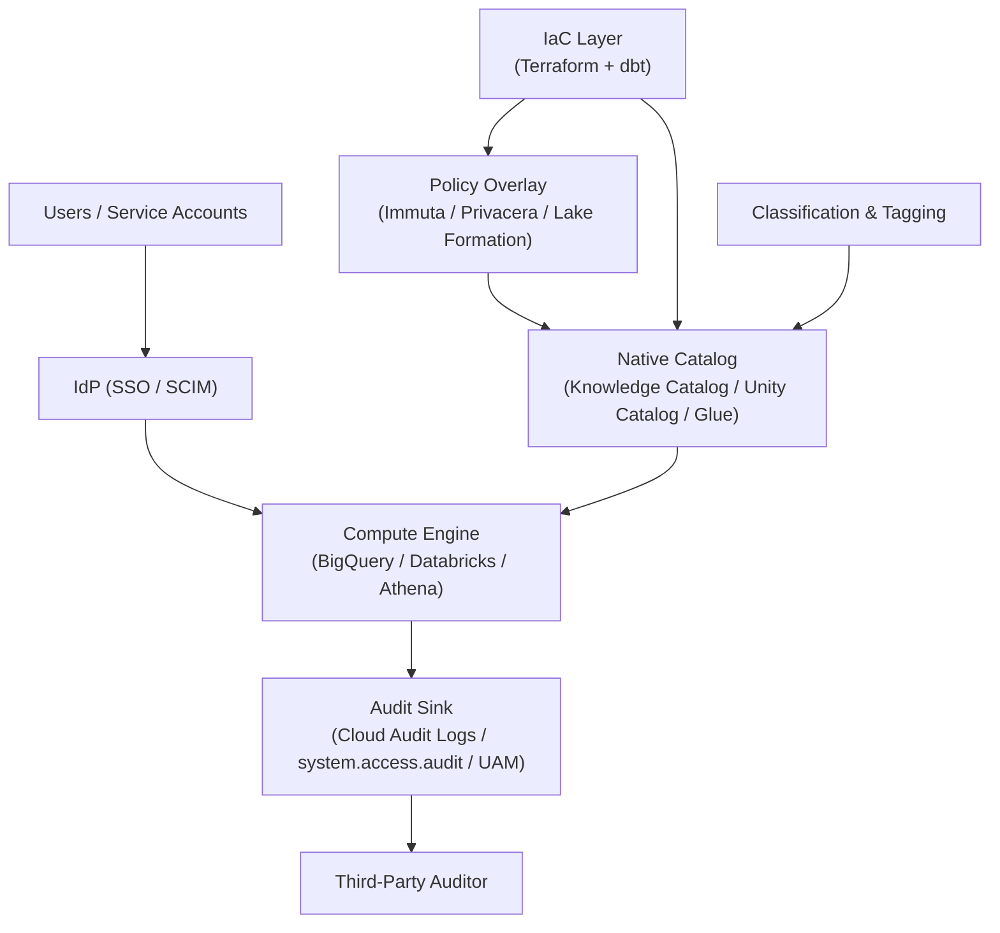

<!-- WRITING PROMPT — opener (2-3 paras):
   - Hook: every cloud DW pitch deck claims "enterprise-grade governance". Read the docs and you find the same ten or so building blocks, assembled differently.
   - Frame this as a survey: I'm going to walk the building blocks, then four platforms (BigQuery, Databricks Unity Catalog, Immuta + Privacera + OneTrust + Lake Formation, dbt + Terraform as the IaC layer), then the auditor lens.
   - State the omission: Snowflake gets its own series — see footnote / link.
   - Tone: opinionated and concrete, like the AI rubrics post.
-->

This is the pillar post. Each section here links to a deep-dive that goes further.

> **The series:**
> - [Data protection in BigQuery](/posts/2026/05/13/bigquery-data-protection/)
> - [Data protection in Databricks Unity Catalog](/posts/2026/05/13/databricks-unity-catalog-data-protection/)
> - [Data policy overlay vendors: Immuta, Privacera, OneTrust, Lake Formation](/posts/2026/05/13/data-policy-overlay-vendors/)
> - [Data governance as code: dbt + Terraform patterns](/posts/2026/05/13/data-governance-as-code-dbt-terraform/)
> - [Where the auditor will find gaps in your data platform](/posts/2026/05/13/data-platform-auditor-gaps/)

## What "data protection" means in this survey

<!-- PROMPT:
   - Define the scope: confidentiality + integrity + availability + privacy + auditability + lineage + residency.
   - Out of scope here: physical security, generic IAM hygiene, app-layer encryption.
   - The lens: the request path. "When a query runs, what stops the wrong data from coming back?"
-->

## A common control taxonomy

<!-- PROMPT:
   - The ten control areas every platform claims, in roughly the order they hit a query:
     1. Identity and coarse access (IAM, project/workspace boundaries).
     2. Fine-grained access (table, column, row).
     3. Masking and tokenization.
     4. Classification and tagging (the input to ABAC).
     5. Lineage.
     6. Audit and observability.
     7. Encryption and key custody (CMEK, EKM, AEAD).
     8. Network isolation (perimeters, private endpoints).
     9. Data sharing (cross-account, cross-org, external).
     10. Residency and sovereignty.
   - Every deep-dive in this series indexes against this taxonomy.
-->

## The layered control model

<!-- PROMPT:
   - Walk the diagram in 2-3 paragraphs.
   - Point out: the catalog is the control plane. Everything bolts onto it.
   - The IaC layer (right side) reaches into both the catalog and the overlay, which is why governance-as-code matters.
   - The audit sink is the control's only proof of operation. If you can't query it, the control didn't happen.
-->

## The platforms at a glance

### BigQuery

<!-- PROMPT — one paragraph:
   - Shape: serverless DW, governance lives in IAM + Data Catalog policy tags + Cloud DLP + Knowledge Catalog.
   - Strength: clean IAM granularity, mature CMEK + EKM, real network perimeter (VPC-SC).
   - Friction: classification (DLP) and catalog (Knowledge Catalog) are separate moving parts you wire yourself.
-->

→ Deep dive: [Data protection in BigQuery](/posts/2026/05/13/bigquery-data-protection/)

### Databricks (Unity Catalog)

<!-- PROMPT — one paragraph:
   - Shape: lakehouse, governance lives in Unity Catalog as a single metastore.
   - Strength: cleanest namespace + grants model, ABAC + governed tags is real, lineage automatic.
   - Friction: hive_metastore legacy still sprawls; serverless network controls have moved a lot; multi-region is a federation problem.
-->

→ Deep dive: [Data protection in Databricks Unity Catalog](/posts/2026/05/13/databricks-unity-catalog-data-protection/)

### Immuta + Privacera + OneTrust + Lake Formation (overlays)

<!-- PROMPT — one paragraph:
   - Shape: a separate control plane sitting beside (or inside) the warehouse.
   - Why use one: heterogeneous estates, purpose-based access, k-anonymity, single normalized audit shape.
   - The AWS-native overlay: Lake Formation plays this role for Glue-backed estates.
-->

→ Deep dive: [Data policy overlay vendors](/posts/2026/05/13/data-policy-overlay-vendors/)

### dbt + Terraform (the IaC layer)

<!-- PROMPT — one paragraph:
   - Shape: not a platform; the connective tissue that keeps the other layers from drifting.
   - Pattern: dbt for what's bound to the data model (grants, classification meta), Terraform for what's bound to the platform (ABAC policies, masking, network rules).
-->

→ Deep dive: [Data governance as code: dbt + Terraform patterns](/posts/2026/05/13/data-governance-as-code-dbt-terraform/)

## How the platforms compare across the ten control areas

<!-- PROMPT — bullet lists, one bullet block per control area. NO markdown tables (project rule).
   For each area, write 1-2 lines per platform calling out the primitive name + a sharp opinion. Example shape: -->

### Identity and coarse access

<!-- PROMPT bullets:
   - BigQuery: IAM at project / dataset / table / view / routine. Predefined and custom roles, IAM Conditions for attribute-style controls.
   - Databricks UC: account-level groups (SCIM-synced) granted SQL-style privileges on UC objects.
   - Immuta: subscription policies abstract away "who can see this table at all".
   - Lake Formation: LF permissions on Glue catalog, granted to IAM principals.
-->

### Fine-grained access (table, column, row)

<!-- PROMPT bullets per platform similar to above. -->

### Masking and tokenization

<!-- PROMPT bullets. Where Immuta is materially deeper (k-anon, format-preserving), say so. -->

### Classification and tagging

<!-- PROMPT bullets. Cloud DLP vs Databricks classification agent vs LF-Tags vs Immuta tags. -->

### Lineage

<!-- PROMPT bullets. UC strongest by default, BigQuery uneven on derived paths, Lake Formation thin, overlays import. -->

### Audit and observability

<!-- PROMPT bullets. Cloud Audit Logs, system.access.audit, UAM, LF events. -->

### Encryption and key custody

<!-- PROMPT bullets. CMEK / Cloud EKM / AEAD vs Databricks two-key model vs LF inheritance. -->

### Network isolation

<!-- PROMPT bullets. VPC-SC vs PrivateLink + IP allowlist + serverless egress vs VPC endpoints. -->

### Data sharing

<!-- PROMPT bullets. Analytics Hub vs Delta Sharing vs Lake Formation cross-account. The auditor gotcha. -->

### Residency and sovereignty

<!-- PROMPT bullets. Region pinning, dual-region behavior, federation paths. -->

## Where each platform leans hardest

<!-- PROMPT — one short paragraph each, the "best at / weakest at" summary:
   - BigQuery: strongest at IAM + perimeter (VPC-SC) + KMS story; weakest at classification + cross-derived lineage.
   - Databricks UC: strongest at namespace + grants + ABAC + lineage + audit-as-SQL; weakest at multi-region + non-UC compute paths.
   - Immuta: strongest at heterogeneous estates + advanced masking + PBAC; weakest at IaC story (no Terraform provider).
   - Lake Formation: strongest at AWS-native consistency + S3 Tables / Iceberg; weakest at multi-cloud (it doesn't try).
-->

## TL;DR of where auditors find gaps

<!-- PROMPT — 5-7 short bullets summarizing the auditor-gaps post. Tease, don't repeat in detail.
   - Service-account sprawl.
   - Lineage gaps for derived / ML feature tables.
   - Inconsistent classification across catalogs and overlays.
   - Policy-as-code vs live-state drift.
   - Key custody and rotation evidence.
   - DSAR + right-to-be-forgotten on Iceberg / Delta.
   - Sharing without DPA traceability.
-->

→ Full treatment: [Where the auditor will find gaps in your data platform](/posts/2026/05/13/data-platform-auditor-gaps/)

## What good actually looks like

<!-- PROMPT — closing, 1-2 paragraphs:
   - The platforms aren't the differentiator. Operations is.
   - The teams that pass clean: classification at the model layer, IaC for everything platform, audit normalized into one queryable place, drift detected nightly, evidence rehearsed quarterly.
   - The pitch: pick the platform that fits your stack, then spend the budget on the operating model — not on the next vendor logo.
-->

## What this survey skips

<!-- PROMPT:
   - Snowflake — covered in a separate series (link forthcoming).
   - Pricing, vendor selection scoring, RFP mechanics.
   - Step-by-step config tutorials (the deep dives link to them).
-->

---

## Sources

This pillar pulls from each deep-dive's reference list. The deep-dive posts hold the full per-section citations.

- BigQuery deep-dive Sources: see [Data protection in BigQuery](/posts/2026/05/13/bigquery-data-protection/#sources)
- Databricks deep-dive Sources: see [Data protection in Databricks Unity Catalog](/posts/2026/05/13/databricks-unity-catalog-data-protection/#sources)
- Overlay vendors deep-dive Sources: see [Data policy overlay vendors](/posts/2026/05/13/data-policy-overlay-vendors/#sources)
- IaC deep-dive Sources: see [Data governance as code](/posts/2026/05/13/data-governance-as-code-dbt-terraform/#sources)
- Auditor gaps deep-dive Sources: see [Where the auditor will find gaps](/posts/2026/05/13/data-platform-auditor-gaps/#sources)
