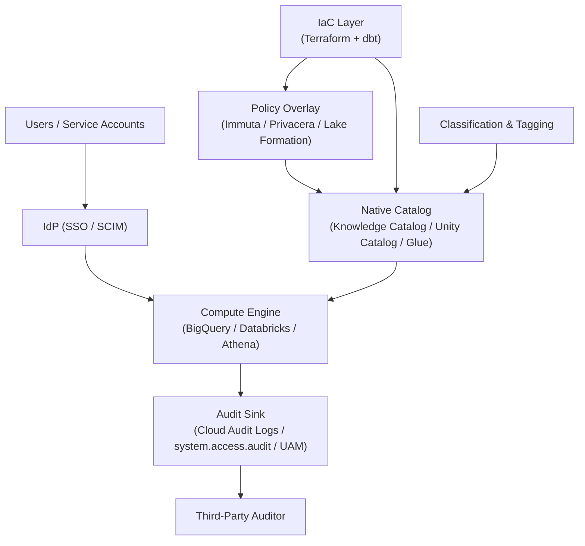

Every cloud data warehouse says it has strong governance. The useful question is simpler: when a query runs, what control fires, and what proof do you have?

This post is a shared evaluation lens for data protection across BigQuery, Databricks Unity Catalog, policy overlays (Immuta, Privacera, OneTrust, Lake Formation), and the dbt + Terraform layer. It gives you one request-path model and ten control areas that apply to any platform. The deep-dives apply the lens platform by platform.

The audience is the engineer or architect who needs to explain their platform's protection posture to an auditor — or verify that it actually works.

> **The series:**
> - [Data protection in BigQuery](/posts/2026/05/17/bigquery-data-protection/)
> - [Data protection in Databricks Unity Catalog](/posts/2026/05/13/databricks-unity-catalog-data-protection/)
> - [Data policy overlay vendors: Immuta, Privacera, OneTrust, Lake Formation](/posts/2026/05/13/data-policy-overlay-vendors/)
> - [Data governance as code: dbt + Terraform patterns](/posts/2026/05/13/data-governance-as-code-dbt-terraform/)
> - [Where the auditor will find gaps in your data platform](/posts/2026/05/13/data-platform-auditor-gaps/)

## What "data protection" means here

A platform protects data if it can defend six properties in front of an auditor. Each one maps to a specific failure an auditor will write up:

- **Confidentiality** — the wrong principal cannot read the wrong bytes. Failure: an analyst pulls a table they were never granted and nobody noticed.
- **Integrity** — the bytes are what the writer wrote. Failure: a pipeline silently overwrites production data and there is no before-image to compare.
- **Availability** — the data is reachable to the right principals when the SLA says so. Failure: a key rotation locks out every downstream consumer for four hours.
- **Privacy** — personal data is minimized, masked, or transformed before it leaves the perimeter. Failure: a DSAR arrives and you cannot enumerate where the subject's data lives.
- **Auditability** — every access decision is logged in a way a third party can reconstruct. Failure: the auditor asks "who read this table last Tuesday?" and you cannot answer.
- **Lineage and residency** — you know where each byte came from and which jurisdiction it lives in. Failure: a derived table contains PII from an EU source and lands in a US region with no record of how it got there.

The scope is the warehouse layer: when a query runs, what stops the wrong data from coming back, and how do you prove the control fired? Physical security, corporate IAM hygiene, and app-layer encryption are out of scope.

## The end-to-end request path

A query is the natural unit of analysis because every control either fires on the request path or it does not exist. The path looks roughly the same on every platform:

1. **Identity resolves.** The IdP issues a token; SCIM has already provisioned groups.
2. **Coarse authorization.** IAM (or the catalog's equivalent) decides if the principal can even reach the object.
3. **Fine-grained authorization.** Row, column, and tag-based policies filter what is visible.
4. **Transformation.** Masking, tokenization, and aggregation rules rewrite the result before it leaves the engine.
5. **Egress controls.** Network perimeter, sharing rules, and residency rules decide where the bytes can land.
6. **Audit emission.** An immutable record of who-asked-what-and-saw-what is written to a sink.

If a control is not on this list, it is not protecting the query — it is supporting evidence (key custody, classification scans, lineage capture) that makes the controls on this list trustworthy.

The verification question at every step is the same: **show me the log line.** A control that cannot produce a queryable audit record is folklore.

## The layered control model

Three notes:

**The catalog is the control plane.** Grants, tags, masks, and row filters live here. If the catalog and the compute engine disagree, the compute engine wins.

**IaC needs a clean split.** dbt should own model-bound metadata. Terraform should own platform policy, network, and key settings.

**Audit is the proof.** If you cannot query the log by principal, object, and time, the control is not ready for audit.

## The ten control areas

The six properties above define what you need to defend. These ten areas define where you look. Each deep-dive evaluates a platform against all ten. The question for each is not "does the UI exist?" but "how do you prove it fired?"

1. **Identity and coarse access** — IAM, groups, and project or workspace boundaries. Check: pull effective permissions from the API, not just the UI.
2. **Fine-grained access** — table, row, column, and view controls. Check: run the same query as a privileged and restricted user.
3. **Masking and tokenization** — dynamic masking, tokenization, and aggregation. Check: show the rewritten result and the rule that caused it.
4. **Classification and tagging** — the labels that ABAC and masking depend on. Check: show the latest scan or tag change and the policy consuming it.
5. **Lineage** — where sensitive data flows downstream. Check: start with one sensitive column and trace derived tables, dashboards, and models.
6. **Audit and observability** — the evidence trail. Check: find the log line by principal, object, and time.
7. **Encryption and key custody** — CMEK, EKM, AEAD, and split-key models. Check: show the key, who can use it, and the last rotation event.
8. **Network isolation** — private paths, perimeters, and egress rules. Check: show the config and at least one denied event.
9. **Data sharing** — internal and external sharing paths. Check: list every share, who received it, and its expiry or agreement.
10. **Residency and sovereignty** — where data lives and where it can move. Check: show the region settings and any cross-region path.

## The platforms at a glance

### BigQuery

Strong IAM granularity, mature KMS options, and a real perimeter with VPC Service Controls. The rough edge is wiring DLP, tags, and policy together without drift.

→ Deep dive: [Data protection in BigQuery](/posts/2026/05/17/bigquery-data-protection/)

### Databricks (Unity Catalog)

Strong namespace model, ABAC, lineage, and audit you can query in SQL. Watch for legacy `hive_metastore`, changing serverless controls, and region-by-region sprawl.

→ Deep dive: [Data protection in Databricks Unity Catalog](/posts/2026/05/13/databricks-unity-catalog-data-protection/)

### Immuta, Privacera, OneTrust, Lake Formation (overlays)

Useful when you need one policy layer across multiple engines, purpose-based access, or deeper masking. The tradeoff is another control plane to keep in sync with the warehouse. Lake Formation is the AWS-native version of this pattern.

→ Deep dive: [Data policy overlay vendors](/posts/2026/05/13/data-policy-overlay-vendors/)

### dbt + Terraform (the IaC layer)

Not a platform. This is the layer that keeps the others consistent. The clean split is dbt for model-bound metadata and Terraform for platform-bound policy.

→ Deep dive: [Data governance as code: dbt + Terraform patterns](/posts/2026/05/13/data-governance-as-code-dbt-terraform/)

### Where each platform leans hardest

- **BigQuery** — Strongest at IAM, VPC-SC, and the KMS story. Weakest at classification automation and derived-path lineage.
- **Databricks UC** — Strongest at namespace and grants, ABAC, lineage, and audit-as-SQL. Weakest at multi-region and non-UC compute paths.
- **Immuta** — Strongest at heterogeneous estates, advanced masking, and purpose-based access. Weakest at IaC ergonomics; the Terraform story is thinner than the policy story.
- **Lake Formation** — Strongest at AWS-native consistency and S3 Tables / Iceberg. Weakest at multi-cloud, by design — it does not try.

## Where auditors find gaps

The recurring findings, summarized. The deep-dive covers recovery patterns for each:

- Service-account sprawl, especially around scheduled queries, Dataform, and Composer.
- Lineage gaps for derived and ML feature tables, where the catalog stops capturing.
- Inconsistent classification across the native catalog and the overlay, with no single source of truth.
- Policy-as-code repo that disagrees with live state because someone clicked in the console.
- Key custody and rotation evidence that exists but cannot be produced in under an hour.
- DSAR and right-to-be-forgotten on Iceberg or Delta, where deletion semantics are subtle.
- External sharing without a traceable DPA on the same principal that received the share.

→ Full treatment: [Where the auditor will find gaps in your data platform](/posts/2026/05/13/data-platform-auditor-gaps/)

## What this post skips

- **Snowflake** — covered in a separate series.
- **Pricing, vendor selection scoring, and RFP mechanics** — opinionated work that doesn't generalize.
- **Step-by-step configuration tutorials** — the deep-dives link to the official guides.

---

## Sources

This post pulls from each deep-dive's reference list. The deep-dive posts hold the full per-section citations.

- BigQuery deep-dive Sources: see [Data protection in BigQuery](/posts/2026/05/17/bigquery-data-protection/#sources)
- Databricks deep-dive Sources: see [Data protection in Databricks Unity Catalog](/posts/2026/05/13/databricks-unity-catalog-data-protection/#sources)
- Overlay vendors deep-dive Sources: see [Data policy overlay vendors](/posts/2026/05/13/data-policy-overlay-vendors/#sources)
- IaC deep-dive Sources: see [Data governance as code](/posts/2026/05/13/data-governance-as-code-dbt-terraform/#sources)
- Auditor gaps deep-dive Sources: see [Where the auditor will find gaps](/posts/2026/05/13/data-platform-auditor-gaps/#sources)
