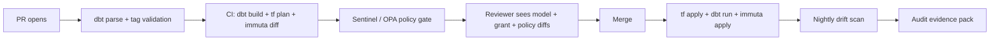

> Part of the overview: [How Modern Data Platforms Protect Data](/posts/2026/05/13/how-modern-data-platforms-protect-data/).
> Sibling deep-dives:
> [BigQuery](/posts/2026/05/17/bigquery-data-protection/) ·
> [Databricks Unity Catalog](/posts/2026/05/24/databricks-unity-catalog-data-protection/) ·
> [Policy overlay vendors](/posts/2026/05/31/data-policy-overlay-vendors/) ·
> [The third-party auditor's gap list](/posts/2026/06/14/data-platform-auditor-gaps/)

Every other post in this series describes controls — IAM, policy tags, ABAC, masking, row filters. This one is about who applies those controls and how, because a control that is hand-clicked in a console is a control that drifts. The argument is blunt: if your access policy lives in someone's browser history instead of a git repository, it is out of date within weeks, and an auditor will find the gap.

The durable pattern is two layers with a clean split. **dbt** owns what is bound to the data model — grants, classification metadata, contracts — because dbt is already the thing creating the tables. **Terraform** owns what is bound to the platform — ABAC policies, masking policies, network rules, key bindings — because those live outside the SQL `CREATE` flow. Get the split right and governance becomes a pull request; get it wrong and you rebuild the same drift you were trying to escape.

## Why governance drifts without IaC

Drift is not one failure; it is a family of them, and each is mundane. A new table is created without a classification tag, so ABAC never protects it. A grant is added in the console for a one-off investigation and never removed. A masking policy is edited in dev and never promoted to prod, or edited in prod and never reflected in dev. Then an auditor asks the question that ends careers: "show me the difference between your policy intent and production reality on January 14." Without IaC, nobody can answer.

The fix has two halves, and you need both. First, a **declarative source of truth** — the policy that should exist, in a repository, reviewed. Second, **drift detection** — a job that reads what actually exists and compares. A source of truth without drift detection is a wish; drift detection without a source of truth is noise. Together they turn "we think prod matches" into "here is the diff, and it is empty."

## The dbt layer

dbt's leverage is that it already runs as the process that creates and refreshes tables, so bolting governance onto that same flow is nearly free. It owns three governance mechanisms — `grants`, `meta`, and contracts — plus the audit trail of the dbt runs themselves.

### 1. The `grants` config

dbt's [`grants` config](https://docs.getdbt.com/reference/resource-configs/grants) declares the privileges that should exist after a model builds, and dbt reconciles them on every run — issuing `grant` and `revoke` statements so the live grants match your configuration exactly. That reconcile-on-every-run behavior is the whole point: drift is corrected automatically each time the model rebuilds, rather than accumulating. The anti-pattern is granting on individual tables to individual users; declare grants to group roles at the project or folder level in `dbt_project.yml` so new models inherit them.

```yaml
models:
  my_project:
    marts:
      +grants:
        select: ['analyst_role', 'bi_service_account']
```

### 2. `meta` for PII / sensitivity tagging

The [`meta` config](https://docs.getdbt.com/reference/resource-configs/meta) attaches arbitrary key-value metadata to models and columns, and it is compiled into dbt's `manifest.json` — which is exactly where a downstream generator can read it. The canonical use, called out in dbt's own docs, is marking a column as containing PII. The pattern that beats hand-tagging is procedural: the same pull request that adds a column declares its classification, so **classification review becomes code review**. A Terraform-generating step then reads the manifest and emits the platform tags.

```yaml
models:
  - name: dim_customers
    columns:
      - name: email
        config:
          meta:
            classification: pii.email
```

### 3. dbt Mesh contracts

A [model contract](https://docs.getdbt.com/docs/mesh/govern/model-contracts) with `enforced: true` makes dbt verify that a model's output matches a declared schema — every column's `name` and `data_type`, plus platform constraints like `not_null` or `primary_key` — and fail the build on mismatch. This is governance, not just data quality: a contract means a tagged column cannot be silently retyped or renamed in a way that would drop its classification, and downstream consumers cannot be quietly broken. Contracts turn the schema itself into a reviewed, enforced artifact (see the [dbt governance overview](https://docs.getdbt.com/docs/mesh/govern/about-model-governance)).

### 4. dbt Cloud RBAC and audit logs

The dbt layer is in the production data path, which means it is in scope for the audit. [dbt Cloud audit logs](https://docs.getdbt.com/docs/cloud/manage-access/audit-log) answer "who deployed what, when," and [enterprise RBAC](https://docs.getdbt.com/docs/platform/manage-access/enterprise-permissions) answers "who was allowed to." For SOC 2, both are required evidence — the change-management story for your governance code is itself a control, and treating dbt as if it were outside the trust boundary is a common oversight.

### 5. Snowflake masking via dbt: the `dbt-snow-mask` pattern

For teams whose classification lives in dbt `meta` and whose warehouse is Snowflake, the community [`dbt-snow-mask`](https://github.com/entechlog/dbt-snow-mask) package bridges the two: a `meta` tag like `pii: true` drives a macro that emits `ALTER TABLE ... MODIFY COLUMN ... SET MASKING POLICY` after the model materializes. It is a clean illustration of the classification-to-enforcement bridge — though it is covered here only as a pattern, since Snowflake's controls belong to a separate series. The general lesson transfers: `meta` is the source of truth, and a generator turns it into native masking DDL.

## The Terraform layer

dbt covers the data model; Terraform covers the platform underneath it — the catalogs, ABAC and masking policies, tag taxonomies, network rules, and key bindings. The clean split is easy to state: **if the resource exists outside the SQL `CREATE` flow, it belongs in Terraform.** A masking policy is not part of a table's DDL; it is a platform object that references the table. That is Terraform's job.

### 6. Databricks Unity Catalog via the `databricks` provider

The full Unity Catalog governance surface is Terraform-addressable. The namespace is `databricks_catalog` and `databricks_schema`; privileges are `databricks_grants`; and — since ABAC went GA in May 2026 — [`databricks_policy_info`](https://registry.terraform.io/providers/databricks/databricks/latest/docs/resources/policy_info) manages the ABAC row filter and column mask policies themselves. The resource takes a `policy_type` of `POLICY_TYPE_COLUMN_MASK` or `POLICY_TYPE_ROW_FILTER`, a UDF `function_name`, and `match_columns` conditions keyed off governed tags — the same model as the SQL `CREATE POLICY` statement, expressed declaratively.

```hcl
resource "databricks_policy_info" "mask_email" {
  name                  = "mask_pii_email"
  on_securable_type     = "SCHEMA"
  on_securable_fullname = "prod.analytics"
  policy_type           = "POLICY_TYPE_COLUMN_MASK"

  column_mask {
    function_name = "prod.governance.mask_email"
  }
  match_columns {
    condition = "has_tag_value('pii', 'email')"
    alias     = "email_col"
  }
}
```

Because governed tags are also manageable through Terraform, the whole loop — tag taxonomy, tag application, and the policy that consumes the tag — can live in one reviewed repository (see the [Databricks grants resource](https://registry.terraform.io/providers/databricks/databricks/latest/docs/resources/grants) and [catalog resource](https://registry.terraform.io/providers/databricks/databricks/latest/docs/resources/catalog)).

### 7. BigQuery via the `google` provider

BigQuery's classification-and-masking surface maps to three resource families: [`google_data_catalog_policy_tag`](https://registry.terraform.io/providers/hashicorp/google/latest/docs/resources/data_catalog_policy_tag) defines the taxonomy, [`google_bigquery_datapolicy_data_policy`](https://registry.terraform.io/providers/hashicorp/google/latest/docs/resources/bigquery_datapolicy_data_policy) attaches masking and column-level security to a tag, and [`google_bigquery_dataset_iam_*`](https://registry.terraform.io/providers/hashicorp/google/latest/docs/resources/bigquery_dataset_iam) binds dataset-level IAM. The pattern that ties this to dbt: the taxonomy lives in Terraform, dbt `meta` annotates which columns wear which tag, and a build step joins the two — so the taxonomy is platform-owned and the assignment is model-owned, each in its natural home.

### 8. AWS Lake Formation via the `aws` provider

Lake Formation follows the same tag-taxonomy-in-Terraform shape: [`aws_lakeformation_lf_tag`](https://registry.terraform.io/providers/hashicorp/aws/latest/docs/resources/lakeformation_lf_tag) defines the LF-Tag keys and values, and [`aws_lakeformation_permissions`](https://registry.terraform.io/providers/hashicorp/aws/latest/docs/resources/lakeformation_permissions) grants on catalogs, databases, tables, or LF-Tag expressions. Remember the seam from the [overlay post](/posts/2026/05/31/data-policy-overlay-vendors/): LF-Tags and row/column/cell data filters do not compose, so if your Terraform grants access via LF-Tag expressions, your data filters will not apply — model the filter grants on the named-resource path instead.

### 9. Sentinel and OPA: gating policy-as-code in PR review

Terraform can apply *anything*, which is precisely the risk — a reviewer skims a large plan and misses a policy regression. [Sentinel](https://developer.hashicorp.com/terraform/intro/phases/govern) (Terraform Cloud/Enterprise) and OPA/conftest (open source) gate the plan against machine-checked rules so the regression fails CI instead of reaching prod. The rules worth writing first are the ones humans miss under pressure: no grant of a `MANAGE`-class privilege to a non-admin group, no masking policy that maps a PII tag to a no-op transform, no public IP in a network allowlist. Policy-as-code is only trustworthy when the policy on the policy is also code.

### 10. The Immuta-no-Terraform-provider gap

Here is the sharp edge. As of 2026 there is **no first-party Immuta provider in the Terraform Registry** — the Immuta namespace publishes only a Snowflake `fast-data-warehouse` scaffolding module, and the community `terraform-provider-immuta` repository is unmaintained (a pre-1.0 build, last pushed in 2024, with `terraform destroy` documented as a no-op). So teams manage Immuta policy through its [V2 REST API](https://documentation.immuta.com/latest/developer-guides/api-intro/) in a CI job, or a provider generated from the OpenAPI spec.

The implication is the one that matters for evidence: **drift detection is not automatic.** With the `databricks` or `google` providers, `terraform plan` *is* your drift report. With Immuta, your CI has to read live policy state through the API and diff it against your checked-in YAML/JSON — and if you skip that step, you cannot answer "how did you know the policy in prod matched what was reviewed?" That is a real SOC 2 exposure, and it is the single strongest argument for keeping as much policy as possible in the native catalog where a Terraform provider exists.

## A reference pipeline shape

Putting the layers together, a governed change flows through one pipeline where the reviewer sees the data model, the grants, and the policy in a single diff:

1. A pull request opens with a dbt model change plus its classification `meta`.
2. Pre-commit runs `dbt parse` and validates the classification tags against the allowed taxonomy.
3. CI runs `dbt build` (dev), `terraform plan` (dev), the Sentinel/OPA gate, and an Immuta API plan-diff.
4. The reviewer sees one PR containing the model diff, the grant diff, and the policy diff.
5. Merge triggers `terraform apply` → `dbt run` → Immuta API apply, with a drift report attached as an artifact.
6. A nightly job re-reads live state, diffs against the repo, and opens an issue if they disagree.



## What good looks like

- **Two repositories at most:** one for data models (dbt), one for platform (Terraform) — sometimes a single monorepo. Not five.
- **All grants reconcile on every dbt run**, so table-level access can never quietly diverge from intent.
- **All ABAC, masking, and row-filter policies live in Terraform plans**, reviewed as diffs.
- **Classification flows from dbt `meta` to platform tags** through a build-time generator, so a column is classified exactly once, at the point it is defined.
- **Drift detection runs nightly** and its output is part of the control-evidence pack — including the Immuta API diff, since its provider gap makes it the likeliest place to drift.
- **No console clicks in production**, except as break-glass with an audited approval trail.

---

## Sources

All sources are linked inline throughout the post. Consolidated here for reference:

**dbt**

- [dbt grants config](https://docs.getdbt.com/reference/resource-configs/grants)
- [dbt `meta` resource config](https://docs.getdbt.com/reference/resource-configs/meta)
- [dbt model contracts](https://docs.getdbt.com/docs/mesh/govern/model-contracts)
- [dbt Mesh governance overview](https://docs.getdbt.com/docs/mesh/govern/about-model-governance)
- [dbt Cloud audit log](https://docs.getdbt.com/docs/cloud/manage-access/audit-log)
- [dbt Cloud enterprise permissions / RBAC](https://docs.getdbt.com/docs/platform/manage-access/enterprise-permissions)
- [`dbt-snow-mask` community package](https://github.com/entechlog/dbt-snow-mask)

**Terraform providers**

- [Databricks UC grants resource](https://registry.terraform.io/providers/databricks/databricks/latest/docs/resources/grants)
- [Databricks UC catalog resource](https://registry.terraform.io/providers/databricks/databricks/latest/docs/resources/catalog)
- [Databricks UC ABAC `policy_info`](https://registry.terraform.io/providers/databricks/databricks/latest/docs/resources/policy_info)
- [Google BigQuery dataset IAM](https://registry.terraform.io/providers/hashicorp/google/latest/docs/resources/bigquery_dataset_iam)
- [Google BigQuery data policy](https://registry.terraform.io/providers/hashicorp/google/latest/docs/resources/bigquery_datapolicy_data_policy)
- [Google Data Catalog policy tag](https://registry.terraform.io/providers/hashicorp/google/latest/docs/resources/data_catalog_policy_tag)
- [AWS Lake Formation permissions](https://registry.terraform.io/providers/hashicorp/aws/latest/docs/resources/lakeformation_permissions)
- [AWS Lake Formation LF-Tag](https://registry.terraform.io/providers/hashicorp/aws/latest/docs/resources/lakeformation_lf_tag)

**Policy-as-code and Immuta**

- [Terraform governance phase (Sentinel / OPA)](https://developer.hashicorp.com/terraform/intro/phases/govern)
- [Immuta V2 API (the no-Terraform-provider workaround)](https://documentation.immuta.com/latest/developer-guides/api-intro/)
