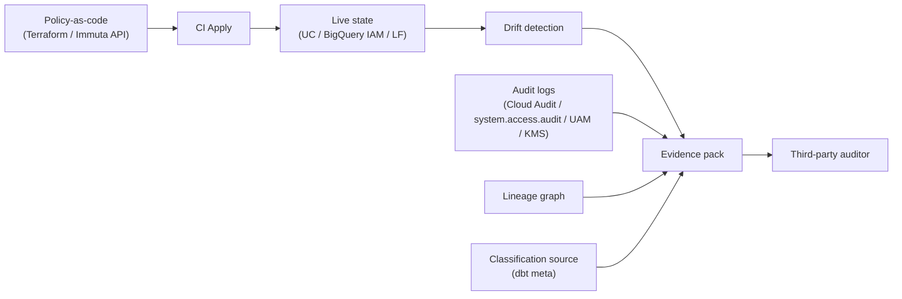

> Part of the overview: [How Modern Data Platforms Protect Data](/posts/2026/05/13/how-modern-data-platforms-protect-data/).
> Sibling deep-dives:
> [BigQuery](/posts/2026/05/17/bigquery-data-protection/) ·
> [Databricks Unity Catalog](/posts/2026/05/24/databricks-unity-catalog-data-protection/) ·
> [Policy overlay vendors](/posts/2026/05/31/data-policy-overlay-vendors/) ·
> [Governance-as-code with dbt + Terraform](/posts/2026/06/07/data-governance-as-code-dbt-terraform/)

Every platform in this series ships strong building blocks. BigQuery has policy tags and VPC Service Controls; Unity Catalog has ABAC and audit-as-SQL; the overlays add purpose-based access and deep masking. So most audit findings are not about missing features. They are about how those features get assembled, evidenced, and operated over time. Sit across the table from a Big-4 SOC 2 or ISO 27701 auditor and the questions are rarely "do you have masking?" — they are "show me the policy that was in effect on March 3rd for this table, and show me who could read this column that day."

This post is that auditor's gap list: the ten findings that recur across BigQuery, Databricks, Immuta, and Lake Formation deployments, each with the symptom an auditor sees, the root cause on these platforms, the frameworks it lights up, and the fix that closes it.

## What an auditor actually looks for

An auditor evaluates a control on three axes, and they are not equally forgiving. First, **design**: is the control built to address a stated risk? Second, **implementation**: is it configured as designed? Third, **operating effectiveness**: did it actually operate, without exception, across the entire audit period? Platform engineers think hard about the first two and rarely about the third — and the third is where audits are lost.

The recurring evidence ask is temporal, which is what makes it hard: "show me the policy that was in effect on date X for table Y," and "show me who could read column Z on date X." A screenshot of today's configuration proves nothing about last quarter. Operating effectiveness is a claim about a time range, and answering it requires evidence that was captured continuously — not reconstructed under pressure the week the auditor arrives.

## The control families auditors map to

Data-platform findings map onto a predictable set of frameworks, and knowing where each one touches the warehouse tells you which evidence you will be asked for. The mappings below recur in every engagement:

- **[AICPA Trust Services Criteria](https://us.aicpa.org/content/dam/aicpa/interestareas/frc/assuranceadvisoryservices/downloadabledocuments/trust-services-criteria.pdf)** (SOC 2): most data findings live in CC6 (logical access) and CC7 (system operations), with Confidentiality (C) and Privacy (P) categories in scope when you elect them.
- **[ISO/IEC 27001:2022](https://www.iso.org/standard/27001)** Annex A: A.5.15 access control, A.5.34 privacy and PII protection, A.8.11 data masking, A.8.12 data leakage prevention.
- **[ISO/IEC 27701:2025](https://www.iso.org/standard/27701)**: as of the October 2025 edition, a *stand-alone* privacy information management system standard rather than an extension of 27001 — covering data-subject rights, lawful basis, and retention.
- **[HIPAA Security Rule](https://www.ecfr.gov/current/title-45/subtitle-A/subchapter-E/part-164/subpart-C)** (45 CFR 164 Subpart C): access control 164.312(a), audit controls 164.312(b), integrity 164.312(c).
- **[PCI DSS v4.0.1](https://www.pcisecuritystandards.org/document_library)** (the only active version since v4.0 retired at the end of 2024, with all formerly future-dated requirements mandatory since March 2025): Req 3 (protect stored data), Req 7 (least privilege), Req 8 (identity and authentication), Req 10 (logging and monitoring).
- **[GDPR](https://eur-lex.europa.eu/legal-content/EN/TXT/?uri=CELEX:32016R0679)**: Art. 25 (privacy by design), Art. 32 (security of processing), Art. 35 (DPIA).
- **[NIST SP 800-53 Rev. 5](https://doi.org/10.6028/NIST.SP.800-53r5)**: the AC (access control), AU (audit and accountability), and SC (system and communications protection) families.
- **[NIST Privacy Framework](https://www.nist.gov/privacy-framework)**: the Identify-P, Govern-P, Control-P, Communicate-P, and Protect-P functions.
- **[CSA Cloud Controls Matrix v4](https://cloudsecurityalliance.org/artifacts/cloud-controls-matrix-v4)**: maps cloud-native controls cleanly onto most of the above.

## The gap catalog

Each gap below follows the same shape: the symptom an auditor sees, the root cause on these platforms, the frameworks it implicates, and a fix that produces evidence rather than just configuration.

### Gap 1: Service account and shared-credential sprawl

**Symptom:** dozens of service accounts with broad read access, shared across pipelines, no rotation cadence, no clear owner. **Root cause:** scheduled queries, Dataform, Cloud Composer, dbt Cloud, and external connectors each spawn their own service account without a registry, and none are ever decommissioned. This lights up SOC 2 CC6.1 and CC6.2, ISO A.5.15, HIPAA 164.312(a)(2)(i), PCI Req 8, and NIST AC-2. **Fix:** manage service accounts as a Terraform module so the registry *is* the source of truth; enforce a maximum key age with rotation; adopt a per-pipeline naming convention; and export quarterly access reviews as evidence, so "who has data access and when did they last use it?" is a query, not an archaeology project.

### Gap 2: Lineage gaps for derived, ML, and feature tables

**Symptom:** a downstream table contains PII, but lineage does not connect it to the source, so you cannot prove the source's masking policy carried through. **Root cause:** lineage capture is uneven — [Unity Catalog](/posts/2026/05/24/databricks-unity-catalog-data-protection/) captures in-scope compute but goes dark outside it, BigQuery lineage on Dataflow and Dataform is partial, and ML feature pipelines are frequently invisible. Frameworks: GDPR Art. 25, NIST Privacy Framework Govern-P, SOC 2 C1.1. **Fix:** require OpenLineage emitters in every pipeline runner; treat column-level lineage as a hard requirement rather than a nice-to-have; and maintain a lineage-coverage dashboard reviewed quarterly, so a table with no inbound lineage is flagged as either a true source or a blind spot.

### Gap 3: Inconsistent classification across catalogs and overlays

**Symptom:** the same logical column is tagged "PII" in dbt `meta`, "confidential" in the BigQuery policy taxonomy, and untagged in Immuta — so the three systems disagree on how sensitive it is. **Root cause:** classification is authored in multiple places with no single source of truth. Frameworks: ISO 27001 A.5.12, SOC 2 C1.1, NIST Privacy Framework Identify-P. **Fix:** declare classification once in dbt `meta`, have build-time generators emit the same tags into the native catalog and the overlay, and run a reconciliation job that alerts on drift — the pattern from the [governance-as-code post](/posts/2026/06/07/data-governance-as-code-dbt-terraform/). One column, one classification, applied everywhere from a single declaration.

### Gap 4: Policy-as-code vs live-state drift

**Symptom:** the policy YAML in the repository does not match the policy running in production. **Root cause:** console clicks during incidents, partial Terraform applies, and Immuta API changes made outside CI — each a small divergence that compounds. Frameworks: SOC 2 CC8.1 (change management), NIST CM-3, PCI Req 6. **Fix:** run a nightly drift scan that reads live state, diffs it against the repository, and opens an issue on any delta; enforce "no console clicks" through IAM by giving humans read-only roles in production; and route emergencies through an audited break-glass path. As the [overlay post](/posts/2026/05/31/data-policy-overlay-vendors/) notes, Immuta's missing Terraform provider makes it the likeliest drift source, so its API diff belongs in the same scan.

### Gap 5: BYOK / HYOK key custody and rotation evidence

**Symptom:** customer-managed encryption is configured, but you cannot produce a key-rotation log or prove who held decrypt rights at a point in time. **Root cause:** KMS audit logs are not captured the way warehouse audit logs are, and the key-admin role is granted too broadly. Frameworks: SOC 2 CC6.1 and CC6.7, PCI Req 3, HIPAA 164.312(a)(2)(iv), ISO A.8.24. **Fix:** pipe KMS audit logs into the same evidence store as warehouse logs; make the key admin a single service account owned by one team; put the rotation cadence in policy; and use external key management where regulators demand custody outside the cloud provider. If you use CMEK or EKM, your compliance story now spans two log sources — treat them as equals.

### Gap 6: Data residency in multi-region and federated query paths

**Symptom:** a query joins a US dataset to an EU dataset and you cannot prove the data did not traverse the wrong region. **Root cause:** BigQuery cross-region copies, Databricks Lakehouse Federation, and Lake Formation cross-account shares all create implicit data movement that no one is watching. Frameworks: GDPR Art. 44–49 (international transfers) and industry-specific residency rules. **Fix:** define VPC-SC perimeters per region; keep per-region metastores and projects; forbid cross-region production queries except through reviewed federation; and record data-movement events in the audit trail so a transfer is a log line, not an assumption.

### Gap 7: DSAR and right-to-be-forgotten on Iceberg / Delta stores

**Symptom:** a deletion request arrives, production tables are Iceberg or Delta, and old snapshots still contain the row for the retention period — you delete from current state but the historical snapshots remain addressable. **Root cause:** open table formats are append-only by design, so row-level deletion is a logical operation, not a physical one. Frameworks: GDPR Art. 17, CCPA/CPRA, HIPAA right of amendment. **Fix:** document a retention and snapshot-expiration cadence; make physical deletion plus `VACUUM` (or Iceberg snapshot expiration) part of the DSAR runbook; and assemble an evidence pack containing the expiration logs, because the auditor will ask you to prove the physical deletion occurred, not just the logical one (see IAPP guidance on [operationalizing DSARs](https://iapp.org/news/a/considerations-for-operationalizing-data-subject-rights-under-gdpr) and [DSARs at scale](https://iapp.org/resources/article/solving-dsars-big-data-problem)).

### Gap 8: Third-party / sub-processor sharing

**Symptom:** Delta Sharing recipients, Analytics Hub listings, or Lake Formation cross-account grants exist with no record of the data-processing agreement or sub-processor disclosure behind them. **Root cause:** sharing is a self-serve operation and legal is not in the loop. Frameworks: GDPR Art. 28, ISO 27701 sub-processor controls, SOC 2 CC9.2. **Fix:** require every sharing grant to reference a ticket linking to a DPA; reconcile the recipient list against the vendor-management registry quarterly; and set an expiry on every share by default, so an unmanaged share ages out instead of living forever.

### Gap 9: AI / ML training data lineage and provenance

**Symptom:** a model card says "trained on customer data" but you cannot enumerate which tables, snapshots, or filtered subsets it actually used. **Root cause:** feature-engineering steps do not emit lineage, and training jobs read from notebooks without capturing a manifest. Frameworks: NIST Privacy Framework Communicate-P, GDPR Art. 22 (automated decisions), and emerging EU AI Act obligations. **Fix:** materialize training datasets as versioned tables (Delta or Iceberg snapshots); have the training job emit a manifest pointing at the exact snapshot IDs; and reference that manifest from the model registry, so provenance is a lookup rather than a reconstruction.

### Gap 10: Control-evidence collection at scale

**Symptom:** it takes the security team three weeks to assemble the evidence pack for an audit. **Root cause:** audit data lives in N places — Cloud Audit Logs, `system.access.audit`, Lake Formation events, Immuta's Universal Audit Model, KMS logs, Terraform Cloud audit, dbt Cloud audit — with no normalized shape. Frameworks: SOC 2 CC4.1 and CC7.2, ISO A.8.15, PCI Req 10. **Fix:** stream every audit source into one warehouse table with a normalized schema; pre-build the queries the auditor always asks ("who could read X on date Y," "what changed in policy P between dates A and B"); and rehearse the evidence ask quarterly, so the three-week scramble becomes a one-day export. Industry advisory work from [KPMG](https://kpmg.com/us/en/articles/2024/framework-success-tackling-challenges-multicloud-security.html), [PwC](https://www.pwc.com/us/en/tech-effect/cloud/cloud-governance-on-risks-and-controls.html), and others converges on the same point: evidence normalization is the differentiator.

## A defensible reference architecture

Synthesize the ten fixes and a consistent picture of "audit-ready" emerges. It is not a longer feature list; it is a set of loops that produce evidence continuously:

- A single source of truth for classification (dbt `meta`).
- All grants, ABAC, and masking applied via IaC, gated by Sentinel or OPA in review.
- Column-level lineage captured everywhere via OpenLineage.
- Audit logs streamed to one normalized warehouse table.
- KMS audit on equal footing with warehouse audit.
- Per-region perimeters, with cross-region paths explicitly reviewed.
- Sharing that requires a DPA reference and defaults to an expiry.
- Training jobs that emit manifests pointing at snapshot IDs.
- A quarterly evidence-pack rehearsal.

## The audit evidence flow

## Closing

The platforms are not the problem. Operations is the problem. The teams that pass clean do not have more features than the teams that fail — they have evidence loops, so every control can prove it fired across the whole period, not just on the day of the walkthrough. Build the evidence loop first, and the controls you actually need become obvious. Skip it, and no amount of masking, ABAC, or perimeter configuration will survive the question that ends every audit: *show me the log line.*

---

## Sources

All sources are linked inline throughout the post. Consolidated here for reference:

**Standards and statutes (primary)**

- [AICPA Trust Services Criteria](https://us.aicpa.org/content/dam/aicpa/interestareas/frc/assuranceadvisoryservices/downloadabledocuments/trust-services-criteria.pdf)
- [ISO/IEC 27001:2022](https://www.iso.org/standard/27001)
- [ISO/IEC 27701:2025 (stand-alone PIMS)](https://www.iso.org/standard/27701)
- [HIPAA Security Rule (45 CFR Part 164 Subpart C)](https://www.ecfr.gov/current/title-45/subtitle-A/subchapter-E/part-164/subpart-C)
- [PCI DSS document library (v4.0.1)](https://www.pcisecuritystandards.org/document_library)
- [GDPR (Regulation EU 2016/679)](https://eur-lex.europa.eu/legal-content/EN/TXT/?uri=CELEX:32016R0679)
- [NIST SP 800-53 Rev. 5](https://doi.org/10.6028/NIST.SP.800-53r5)
- [NIST Privacy Framework](https://www.nist.gov/privacy-framework)
- [California CCPA / CPRA](https://leginfo.legislature.ca.gov/faces/codes_displayText.xhtml?lawCode=CIV&division=3.&part=4.&title=1.81.5.)
- [CSA Cloud Controls Matrix v4](https://cloudsecurityalliance.org/artifacts/cloud-controls-matrix-v4)
- [EDPB — GDPR Article 35 (DPIA)](https://www.edpb.europa.eu/gdpr-articles/article-35-data-protection-impact-assessment_en)

**Practitioner / industry**

- [IAPP — operationalizing GDPR DSARs](https://iapp.org/news/a/considerations-for-operationalizing-data-subject-rights-under-gdpr)
- [IAPP — DSARs at warehouse scale](https://iapp.org/resources/article/solving-dsars-big-data-problem)
- [KPMG — multicloud security & data governance](https://kpmg.com/us/en/articles/2024/framework-success-tackling-challenges-multicloud-security.html)
- [PwC — cloud governance, risks, and controls](https://www.pwc.com/us/en/tech-effect/cloud/cloud-governance-on-risks-and-controls.html)
- [Deloitte — Chief Data Officer Survey 2025](https://www.deloitte.com/nl/en/services/consulting-risk/research/chief-data-officer-survey-2025.html)
- [ISACA — Rethinking data governance](https://www.isaca.org/resources/white-papers/rethinking-data-governance-and-management)
