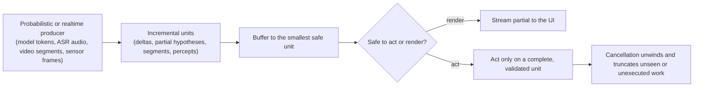

> Part of a series on agentic reliability. Previous: [How agents handle structured I/O](/posts/2026/07/22/how-agents-handle-structured-io/).

Streaming, in an LLM chat or agentic system, is the practice of serving a model's output incrementally as it is generated instead of waiting for the full response. It matters because the producer is probabilistic and the output is structured — a partial chunk is not simply a smaller correct answer, it is an object that may still be wrong, incomplete, or unsafe to act on.

The previous post in this series ended on that exact seam: constrained decoding makes the *final* JSON schema-valid, but a partial document mid-stream is invalid by definition, and a tool-call argument you execute early is worse than one you wait one more chunk for. That observation generalizes far past JSON. This post pulls the camera back to the whole streaming stack — how it actually works under the hood, why it is a different problem than streaming used to be, and what it shares with three systems that solved adjacent versions of it decades before LLMs existed: voice assistants, self-driving cars, and video streaming.

## How LLM streaming actually works

Under the hood, an LLM chat response is not one generation step — it is two phases with opposite performance profiles, and the split explains almost every serving decision downstream. **Prefill** processes the entire input prompt in one parallel forward pass to build the key-value (KV) cache; it is compute-bound, and its duration sets **time-to-first-token (TTFT)**. **Decode** then generates one token at a time, re-reading the KV cache and model weights on every step; it is memory-bound, and the gap between tokens is **inter-token latency (ITL)**, the number that determines whether a chat feels like it's "typing" smoothly or stuttering.

Because the two phases compete for the same GPU when colocated — a long prompt's prefill blocks decode steps for every other concurrent request — 2026 production serving increasingly runs them on separate pools and streams the KV cache between them over RDMA or NVLink, a pattern called [disaggregated prefill/decode serving](https://docs.modular.com/glossary/ai/disaggregated-inference/). This is on top of continuous batching, which admits new requests into a running batch token-by-token instead of waiting for the slowest sequence in a fixed batch, and which is what makes concurrent chat sessions economical in the first place. [AWS describes the production motivation directly](https://aws.amazon.com/blogs/machine-learning/disaggregated-prefill-and-decode-for-llm-inference-on-sagemaker-hyperpod/): disaggregation lets you "tune TTFT and ITL independently" instead of trading one off against the other on shared hardware. What reaches the client on the wire is a sequence of server-sent events, one per token or per small delta — the transport is simple; the two-phase engine behind it is not.

## What makes streaming hard now

Streaming used to mean serving bytes or records from a deterministic source, in order, for a consumer that only displayed them. Agentic streaming breaks every part of that sentence at once. The output is structured (JSON arguments, code, tables) but arrives token-by-token, so a chunk boundary rarely lines up with a structural boundary. Multiple tool calls can stream in parallel, keyed by index or ID, and a client has to buffer each independently rather than assume one linear stream. The consumer is sometimes a renderer and sometimes an executor — and only one of those is safe to hand a partial value to. [Provider streams also skip server-side validation](https://platform.claude.com/docs/en/agents-and-tools/tool-use/fine-grained-tool-streaming) for latency, which means the accumulation contract (start empty, append deltas, parse and guard on close) is the client's problem, not the server's. Add cancellation — a user stops the stream, or a downstream tool has already fired — and now the system needs to unwind state that was already partially committed. None of this existed in a `cat file | client` byte stream.

## Why this is different from streaming before

Byte and record streams (a file download, a database cursor, a Kafka topic) are deterministic: the producer already knows the full content, and streaming is purely a transport optimization for reducing time-to-first-byte. Every prefix of the stream is a valid prefix of a known, correct final result. LLM streaming inverts that guarantee. The producer is sampling, so the "correct" output is not fixed in advance — a token that looked fine can be followed by a token that breaks the JSON, contradicts an earlier claim, or gets revised by a tool result two turns later. The unit of streaming also changed from *bytes* to something *semantic*: a token can complete a field, split a word, or land in the middle of a number. That is why the old rule — "a partial chunk is safe to consume, just incomplete" — no longer holds, and every mechanism in the sections above (buffering, dispatch gating, cancellation) exists specifically to restore a version of that guarantee for a producer that no longer offers it for free.

## Partial and streaming, beyond JSON

The two problems from the JSON post — partial parsing and streaming's interaction with structure — turn out to be the general case, not a JSON-specific one. Any tool that emits structured or stateful output while streaming needs the same two capabilities: a partial-aware parser or renderer, and a dispatch boundary that decides what is safe to act on before the structure is complete.

- **Code and diffs.** Coding agents stream patches token-by-token, but an `apply-patch` or file-edit tool cannot apply a diff that is still being written. Codex's maintainers made this explicit when they [refused to auto-repair truncated tool arguments](https://github.com/openai/codex/issues/19765) for exactly this reason — a silently repaired patch can mutate intent.
- **SQL and shell commands.** A streamed query or command string is unsafe to execute until it closes; running `DELETE FROM orders WHERE id = 1` because the stream happened to pause after `id = 1` and before the rest of the clause is the SQL version of the JSON truncation bug.
- **Parallel multi-tool calls.** OpenAI and Gemini can return multiple tool calls in one turn; Claude can chain them sequentially. Each needs its own buffer keyed by call ID, and dispatching the first complete call before the provider signals the full set is final risks acting on a set the model hasn't finished emitting.
- **Reasoning and thinking tokens.** Extended-thinking traces stream like content but are explicitly not meant to be acted on — they are process, not output — so UIs render them but no executor should ever treat a thinking-token stream as an instruction.
- **Voice output.** A streaming TTS pipeline needs sentence- or clause-boundary buffering, not per-token flushing, or the audio sounds chopped — the same "buffer to a meaningful unit, not a byte count" logic as partial JSON.

The pattern repeats because the underlying cause repeats: whenever the producer is a model and the consumer can act, "partial" has to mean "buffered until safe," not "displayed as it lands."

## Compared to voice assistants: Alexa's streaming ASR

Voice assistants solved a version of this problem years before LLM chat existed, because speech has always arrived as an incomplete stream. A streaming ASR model emits partial transcription hypotheses roughly every 100 ms, well before the user finishes speaking, and a separate **endpointing** step decides when a `is_final` boundary has actually been reached — [production systems mostly wait for that final flag](https://hld.handbook.academy/curriculum/ai-ml-system-design/realtime-ai-voice-agents/) rather than acting on interim hypotheses, because the endpointing delay is small next to the LLM generation time that follows anyway. The RNN-Transducer architecture behind this, pairing a [Conformer encoder with a streaming decoder](https://www.arunbaby.com/speech-tech/0001-streaming-asr/), is built specifically to emit tokens incrementally without waiting for future audio context — the acoustic equivalent of emitting a token before you know the rest of the sentence.

The piece that has no clean LLM-chat analog yet is **barge-in**: voice activity detection stays active during the assistant's own playback, and when it detects new user speech it cancels the in-flight generation, stops TTS mid-sentence, and — critically — truncates the conversation history to exclude audio the user never actually heard, so the model's own memory doesn't include a reply it never finished delivering. OpenAI's Realtime API exposes this directly as `conversation.item.truncate`. Text-based agentic streaming rarely does the truncation step at all; a cancelled stream usually just stops, leaving whatever text rendered as-is in the transcript, which is a real gap compared to how mature the voice pattern is.

## Compared to self-driving: Tesla FSD's real-time loop

Self-driving systems make the "never act on a bad partial" rule non-negotiable in a way chat systems mostly get to treat as a UX nicety. Tesla's FSD stack runs perception, prediction, and planning as a tightly bounded on-device loop with a decision cycle commonly described as landing under 100 ms end-to-end, because at highway speed even a small added delay translates directly into extra stopping distance. Reported architectures describe [temporal fusion across a multi-frame window](https://applyingai.com/2025/07/decoding-teslas-core-ai-and-hardware-architecture-a-ceos-perspective/) — a rolling few seconds of camera context, structurally similar to an LLM's context window — feeding a planner that only commits to an action once that window's percept is coherent, with degraded-input handling (heavy rain, occlusion) treated as a first-class case rather than an edge case.

The transferable idea is not the specific latency number — automotive safety engineering and chat UX have very different failure costs — it is the posture: the system is designed around the assumption that a percept can be incomplete or wrong, and the architecture's job is to gate action behind confidence, not to render every partial percept as if it were final. That is precisely the posture a tool-dispatch boundary is trying to enforce in an agentic loop; the difference is that FSD treats it as physical safety and agentic systems have, so far, mostly treated it as JSON hygiene.

## Compared to video streaming: Netflix's adaptive bitrate

Netflix's problem looks the least related on the surface and is the most instructive on buffering discipline. Video is chopped into independently decodable segments, typically [2-4 seconds long](https://sujeet.pro/articles/design-netflix-streaming), each available at multiple bitrates; the client's adaptive-bitrate (ABR) algorithm picks a quality rung per segment by combining a throughput estimate with current buffer occupancy, and production systems lean toward the buffer-based half of that combination for stability — the classic [buffer-based approach from SIGCOMM 2014](https://yuba.stanford.edu/~nickm/papers/sigcomm2014-video.pdf) and the near-optimal Lyapunov controller [BOLA](https://arxiv.org/pdf/1601.06748) both prioritize keeping the buffer healthy over reacting instantly to every bandwidth fluctuation, because chasing every network blip causes visible quality oscillation. The player deliberately starts conservative and ramps up over 15-30 seconds rather than guessing the ideal quality on segment one.

The reason this maps cleanly onto LLM streaming is the segment: it is a fixed-size, independently usable unit, chosen specifically so the client can buffer several ahead without depending on content it hasn't seen yet. LLM token streams have no such unit — a model does not pre-declare "this JSON field will take 40 tokens" — so a client cannot borrow Netflix's fixed-ahead-buffer strategy directly. What it *can* borrow is the underlying principle: decide the smallest unit that is safe to consume, then optimize buffering and latency within that unit rather than at the byte level. For LLM streaming that unit is semantic (a closed JSON value, a finished sentence, a completed tool call) instead of a fixed byte count, but the buffer-before-you-commit discipline is the same idea wearing different clothes.

## What transfers back

Putting the three analogies against the challenges from earlier in this post shows a clean split between what generalizes and what doesn't.

**What transfers.** Netflix's lesson is buffering discipline: define the smallest unit that is safe to consume, and never let a slow downstream consumer block the upstream read — buffer on your own side instead. Alexa's lesson is clean cancellation: barge-in shows that stopping a stream is not enough; you also have to truncate the record of what was never actually delivered, which agentic systems mostly skip today. FSD's lesson is the safety gate itself: the tool-dispatch boundary (accumulate, validate, then act) is the chat-system version of "don't plan a lane change off a percept you haven't finished forming."

**What doesn't transfer.** Netflix's fixed 2-4 second segment has no LLM equivalent — token streams have no pre-declared unit size, so pre-buffering "N chunks ahead" the way a video player does isn't possible; you can only buffer to the next semantic boundary, whenever it arrives. Voice and vision pipelines have one producer generating one stream at a bounded rate; agentic systems can fan out multiple tool calls and even sub-agents streaming in parallel, which none of the three comparison domains have to reconcile into one timeline. And unlike a paused video download or a resumed ASR session, LLM streams are still not resumable mid-generation across providers in 2026 — a dropped connection means replaying from the last checkpointed turn, not resuming the generation itself.

## Takeaways

- **The unit of streaming moved from bytes to semantics.** A chunk boundary rarely lines up with a structural boundary, so every consumer needs to decide the smallest unit that is safe to use, not just accept whatever arrived.
- **TTFT and ITL come from two physically different phases.** Prefill is compute-bound and sets TTFT; decode is memory-bound and sets ITL. Production serving increasingly disaggregates them onto separate hardware to tune each independently.
- **Render versus act is the load-bearing distinction.** A partial value is fine for a UI and dangerous for a tool call, a shell command, or a database write — the dispatch boundary exists specifically to enforce that split.
- **The pattern from the JSON post generalizes past JSON.** Code diffs, SQL, parallel tool calls, reasoning traces, and TTS all need the same two things: a partial-aware parser and a gate on when it's safe to act.
- **Voice assistants solved cancellation; self-driving solved safety gating; video streaming solved buffering.** Agentic systems need all three, and today mostly borrow the third while under-investing in the first two — cancellation in most chat UIs stops the stream but doesn't truncate the unseen tail the way barge-in does.
- **Streams still aren't resumable.** Treat a dropped connection as "replay from the last durable checkpoint," not "resume the generation," because no major provider supports the latter yet.
