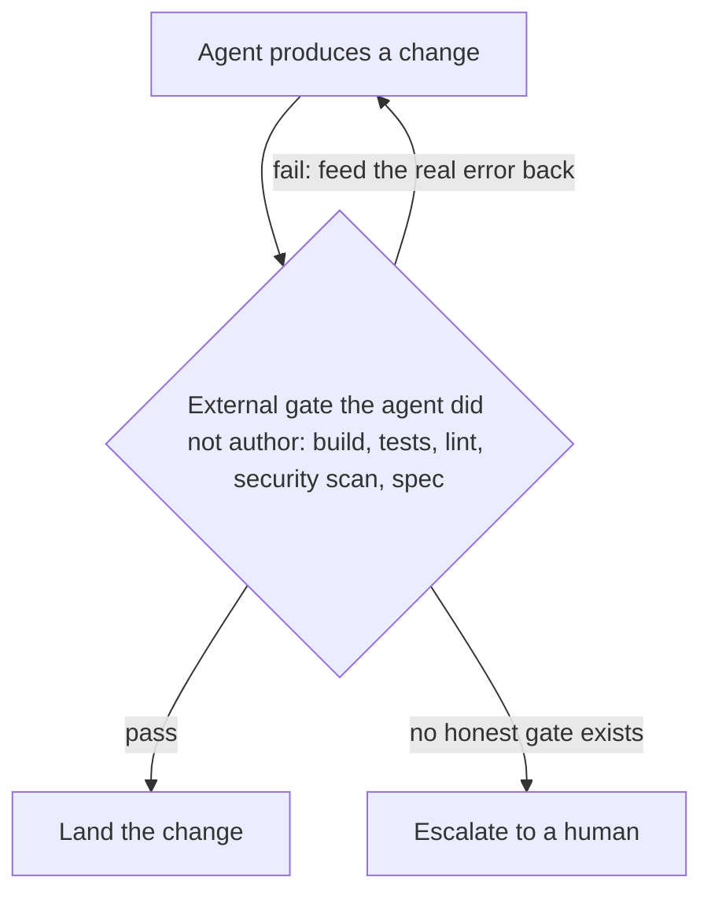

> Part of a two-post series on structuring agentic systems. Previous: [Skills vs. subagents: when to use each in coding agents](/posts/2026/07/27/skills-vs-subagents-when-to-use-each/).

How many coding agents you can run at once is capped by one thing: how much you trust your verification loop. Boris Cherny's AI-adoption ladder climbs from one supervised agent to a thousand autonomous ones, and every rung is gated by verification. Anthropic just published how to build that loop as skills. The rule the accountable engineers add, and the vendor framing underplays: the gate has to be external and able to fail, or the trust is fake.

## The ladder is a trust ladder

Boris Cherny, who built Claude Code, [mapped out the four steps of AI adoption he keeps seeing teams take](https://x.com/bcherny/status/2077929379661844559) in July 2026, from a gated Step 0 baseline up to a fully autonomous Step 4. The striking thing is what sets each rung.

- **Step 1, assisted (~1 agent).** You and one agent, mostly supervised, reviewing almost every change. The bottleneck is your attention: in Cherny's words, "due to low trust for the model's output and lack of self-verification, you feel you must read everything, so you never look away."
- **Step 2, parallel (~10 agents).** One engineer orchestrates five to ten agents on separate worktrees, reviewing final diffs instead of keystrokes.
- **Step 3, supervised autonomy (~100 agents).** Claude writes nearly all the code; you manage a tree of agents.
- **Step 4, AI-native (~1,000+ agents).** The loop is closed, most agents are launched by other agents, and you steer by intent.

The counts step by roughly 10x a rung: 1, 10, 100, 1,000. What lets you make each jump is the same thing every time. Cherny is blunt that "tokens aren't enough to move you forward"; each step means you "find and break down the next set of bottlenecks" and "build up the next set of guardrails," and "in practice that means giving Claude ways to verify its own work end to end." The explicit unlock from Step 1 to Step 2, in his words, is "a self-verification loop you trust (tests + build + lint + e2e testing with a real dev environment)," and the named trap at Step 3 is "scaling agent count before the loop has earned widespread trust." He puts Anthropic itself at step 3 and pushing toward 4, so the top rungs are still frontier, not default. The ladder is not really about agents. It is about trust, and verification is how you earn it.

## The loop that moves you up a rung

A week later, [Delba de Oliveira of the Claude Code team published the how-to](https://claude.com/blog/building-verification-loops-in-claude-code-with-skills). Claude already reads the deterministic signals in your repo — type checkers, linters, tests, runtime errors. The manual checks you still do by hand are what you turn into a loop. The recipe: write down what you correct every time, phrase it "the way you'd hand it to a new teammate on day one," and encode it as a skill so it runs every session instead of relying on memory.

What I'd adopt directly:

- **Encode the checks you repeat as skills** — including the project-specific rules a generic linter misses. Their example: "reject any migration that drops a column without a backfill step."
- **Climb the maturity arc:** standalone (you invoke it), embedded (the producing skill runs it), chained (one skill calls the next), on every PR (everyone's changes pass the same gates). "What started as a habit becomes a contract."

That arc is Cherny's ladder one level down. Each step removes a human from a loop that used to need one.

## The one rule I won't drop: the gate has to be able to fail

Here is where I part from the optimistic reading. A loop that re-runs a check is worth something only if the check can come back red. [As the paelladoc writeup puts it](https://paelladoc.com/blog/verification-loops/), "the check has to be able to fail. If you cannot describe the input that turns it red, it is not verifying anything."

And the gate has to check something the agent did not write. If the agent produced the code and the tests in the same pass, "tests pass" only confirms the code agrees with itself. The [Boundary-First Engineering](https://codo.tech/blog/your-ai-agent-should-not-grade-itself-software-self-verification-crisis/) manifesto calls this circular validation and asks the right question: "who verifies the code when the AI wrote the checks too?" Gate against something from outside the implementation loop — acceptance criteria written before generation, a contract test the code never saw, a build that must produce a running artifact.

[Amin Mirlohi](https://mirlohi.com/articles/dont-let-the-agent-grade-itself) makes it a rule you can enforce: "a real command that exits zero only when the work is genuinely done, not the model's opinion of itself." When it fails, the next attempt gets the real error log appended, "not vibes." Simon Willison lands in the same place from the practitioner side — [automated tests are no longer optional with agents](https://simonw.substack.com/p/agentic-engineering-patterns), because "if the code has never been executed it's pure luck if it actually works when deployed to production."

## Why self-grading fails: it is measured, not a vibe

This is not a stylistic preference. Huang et al. showed that large language models cannot reliably self-correct reasoning without external feedback — asked to review their own answers, they change correct ones to wrong more often than they fix errors. Later work names two failure modes that bite here: an [accuracy–correction paradox](https://arxiv.org/html/2604.22273v2), where stronger models are hurt more by unprompted self-critique, and a [self-correction blind spot](https://openreview.net/pdf?id=7K1kXowjK1), where a model fixes an error handed to it as someone else's but misses the identical error in its own output.

The lesson maps straight onto the loop. Self-critique without an external signal is not a cheap verification tier. It is a way to amplify the model's own confidence, including where that confidence is wrong. The gains come from outside: a tool result, an execution signal, a grader the model did not author.

## Two tiers: a critic and a gate

The clean production shape, from [Sonar's loop-engineering work](https://www.sonarsource.com/blog/loop-engineering-without-verification-is-just-automation/), is two tiers. An LLM verifier gives a fast, probabilistic critique of intent and semantics. Useful, but "it is not a gate." The gate is the deterministic, security-aware check the loop halts on — "the part you build last and trust most."

Run the critic tier in a fresh context window — a subagent, from the last post — so it is not reviewing its own reasoning. Keep the deterministic command as the halt. And when no honest deterministic gate exists (visual polish, prose, a judgment call), that is the signal to keep a human in the loop, not to let the model self-certify.

## Climbing faster than trust is how you fall

Cherny's ladder rewards patience, and the accountable practitioners explain why. [Simon Willison](https://simonwillison.net/2026/May/6/vibe-coding-and-agentic-engineering/) no longer reviews every line his agents write, and says so honestly: "if I haven't reviewed the code, is it really responsible for me to use this in production?" Mario Zechner, who built the Pi agent framework, is sharper: with an army of agents "these tiny little harmless booboos suddenly compound," and because you removed yourself from the loop, ["you only feel the pain when it's too late."](https://simonwillison.net/2026/Mar/25/thoughts-on-slowing-the-fuck-down/) Margaret Storey's name for the residue is cognitive debt — the gap between the code you ship and the code you understand, widening because agents write faster than anyone reads.

Put Cherny and Zechner together and the rule writes itself: add agents only as fast as your loop earns trust. Scaling agent count on borrowed trust is like adding climbers to an anchor you placed yourself and never load-tested. The verification loop is not overhead on the ladder. It is the ladder.

## Takeaways

- **Verification is the rate-limiter of AI adoption.** You can run as many agents as your loop can check, and no more. The 1 → 10 → 100 → 1,000 jumps are gated by trust in the loop.
- **Adopt the skill-as-loop mechanism.** Encode the checks you repeat, including project rules linters miss, and climb standalone → embedded → chained → every-PR.
- **The gate must be external and able to fail.** A check the agent authored, or one you cannot turn red, verifies nothing.
- **Self-grading degrades quality, and that is measured.** LLMs cannot reliably self-correct without an external signal. Use an LLM as a critic tier, never as the gate.
- **When you cannot write the gate, keep a human.** Subjective work is a signal, not a gap to automate over.
- **Add agents only as fast as the loop earns trust.** Otherwise you climb on cognitive debt and feel it too late.

Cherny's Step 1 names the feeling exactly: at one agent, you never look away. The rest of the ladder is the slow work of earning the right to.
