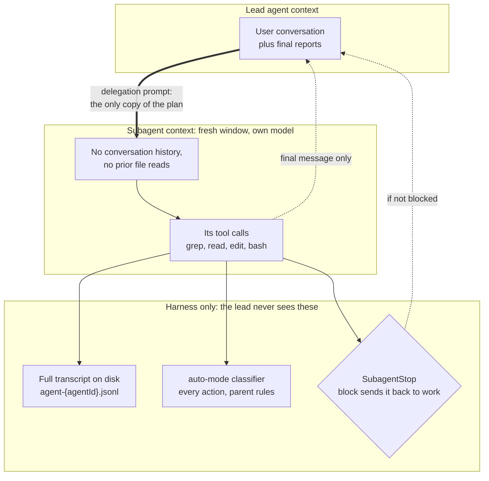
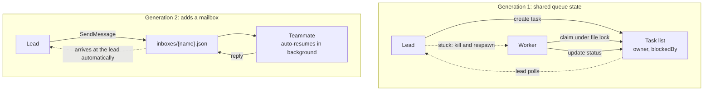

> Part of a series on structuring agentic systems. Previous: [The verification loop decides how many agents you can run](/posts/2026/07/28/make-an-agentic-workflow-deterministic-and-verifiable/).

An orchestrating agent is blind on purpose. Its teammates run in their own context windows, and only their final messages come back. The harness, meanwhile, sees every tool call they made and writes their full transcripts to disk. That gap between what the model knows and what the harness knows is not a leak in the design. It is the design, and it decides where orchestration control has to live.

The [skills-versus-subagents post](/posts/2026/07/27/skills-vs-subagents-when-to-use-each/) established the isolation baseline, and the [verification-loop post](/posts/2026/07/28/make-an-agentic-workflow-deterministic-and-verifiable/) argued that your checking loop caps how many agents you can run. This one is about the machinery in between: what crosses the boundary, who can see across it, and why the answer is almost never "the orchestrator."

## Four shifts, in the order they actually happened

Claude Code's capability changed shape four times in eighteen months, and the order matters more than the labels. It ran commands, then it planned before running them, then it spawned other agents, then a workflow layer appeared on top to schedule them. The dates come from the [public changelog](https://raw.githubusercontent.com/anthropics/claude-code/main/CHANGELOG.md), cross-checked against npm publish timestamps.

- **Execution** — [February 24, 2025](https://www.anthropic.com/news/claude-3-7-sonnet), shipped as a limited research preview alongside Claude 3.7 Sonnet.
- **Plan before execution** — undated. No changelog entry announces Plan Mode; the earliest mention is an *improvement* line in v1.0.33 on June 23, 2025, so it predates that.
- **Delegation** — [hooks](https://code.claude.com/docs/en/hooks) on June 30, 2025 (v1.0.38), then custom subagents on July 24, 2025 (v1.0.60): "You can now create custom subagents for specialized tasks." [Agent Skills](https://claude.com/blog/skills) followed on October 16, 2025, and background agents on December 5, 2025: "Agents run in the background while you work."
- **Orchestration** — agent teams as a research preview on February 5, 2026 (v2.1.32), then dynamic workflows on May 28, 2026 (v2.1.154): "ask Claude to create a workflow and it orchestrates work across tens to hundreds of agents in the background."

Teams came before dynamic workflows, not after. The primitive shipped first and the scheduling layer arrived three months later, which is the normal order for infrastructure and the opposite of how the progression feels from the outside. The simplification came third: on June 15, 2026, v2.1.178 "removed the TeamCreate and TeamDelete tools," and "every session now has one implicit team."

The components barely change. What changes is who talks to whom, and how much of the conversation each participant can see.

```mermaid
flowchart TB
  subgraph era1["1. Execution, Feb 2025"]
    direction LR
    u1["User"] --> ag1["Agent"] --> tl1["Tools"]
  end
  subgraph era2["2. Plan, then execute, by Jun 2025"]
    direction LR
    u2["User"] --> pl2["Plan\nread-only"] --> ap2{"Approve"} --> ag2["Agent"] --> tl2["Tools"]
  end
  subgraph era3["3. Delegation, Jul 2025"]
    direction LR
    u3["User"] --> ag3["Lead agent"]
    ag3 ==>|"prompt"| sa3["Subagent\nfresh context"]
    sa3 --> tl3["Tools"]
    sa3 -.->|"final message"| ag3
  end
  subgraph era4["4. Orchestration, Feb to May 2026"]
    direction LR
    u4["User"] --> ld4["Team lead"]
    wf4["Workflow layer"] --> ld4
    ld4 ==>|"prompts"| tm4["Teammates\nown contexts"]
    tm4 -.->|"reports"| ld4
    ld4 --> tq4["Task list\nowner, blockedBy"]
    tm4 --> tq4
    ld4 --> mb4["Mailbox"]
    mb4 --> tm4
  end
```

Note the arrows in the last two rows. The thick one carries everything the teammate will ever know. The dotted one carries everything that comes back.

## What crosses the boundary

Very little crosses, and that is the point. The [subagents docs](https://code.claude.com/docs/en/sub-agents) are explicit: each subagent "starts with a fresh, isolated context window" and "doesn't see your conversation history, the skills you've already invoked, or the files Claude has already read." Its window is "sized by its own model, not the parent's." Coming back the other way, per the [Agent SDK docs](https://code.claude.com/docs/en/agent-sdk/subagents), "intermediate tool calls and results stay inside the subagent; only its final message returns to the parent."

So the delegation prompt is the entire contract. Whatever you do not write into it does not exist on the other side. That is the real reason orchestrators over-specify: the prompt is not a summary of the plan, it is the only copy of the plan the teammate will ever have.

There is an escape hatch, and it is more interesting than the boundary. A **fork**, created with `/subtask`, "is a subagent that inherits the entire conversation so far instead of starting fresh," which "drops the input isolation that subagents otherwise provide." One primitive to keep context out, one to let all of it in. Choosing between them is the whole design decision.

## The harness sees what the orchestrator cannot

Isolation hides the work from the parent *model*. It does not hide the work from the runtime. Subagent transcripts persist to disk at `~/.claude/projects/{project}/{sessionId}/subagents/agent-{agentId}.jsonl`, and the [`SubagentStop` hook](https://code.claude.com/docs/en/hooks) receives `agent_id`, `agent_type`, `agent_transcript_path`, and `last_assistant_message`. The lead agent reads a paragraph. The harness holds the file.

The shape is familiar from operating systems. A subagent is a process, not a thread: its own address space, no shared memory with the parent. The final message is its stdout and its exit status. `SubagentStop` is the parent's `SIGCHLD` handler, and returning `decision: "block"` with a reason "keeps the subagent running and delivers `reason` to the subagent as its next instruction." The parent refuses to reap the child and sends it back to work.

That last mechanism is the one to internalize. If you want a teammate to stop claiming it is finished when it is not, a `SubagentStop` hook can deterministically refuse. An instruction in the orchestrator's prompt cannot. Good intention will not hold a fleet of agents in line; a mechanism will. Claude Code now exposes 31 hook events, including `SubagentStart`, `TaskCreated`, `TaskCompleted`, and `TeammateIdle`. Those are lifecycle hooks for *agents*, not just for tools. Control migrated to where the visibility already was.

Permission mode `auto` shows the same division of labor from the security side, and it is the clearest statement of the whole idea. Per the [permission modes docs](https://code.claude.com/docs/en/permission-modes), the harness evaluates the delegated task description *before* a subagent starts, so "a dangerous-looking task is blocked at spawn time." While it runs, "each of its actions goes through the classifier with the same rules as the parent session, and any `permissionMode` in the subagent's frontmatter is ignored." When it finishes, "the classifier reviews its full action history," and a flagged concern gets "a security warning prepended to the subagent's results."

The subagent's own declared configuration is overridden by the runtime, and the action history the orchestrator never sees is exactly what gets reviewed on the way out. The lead reads the report; the classifier reads every action. Note what the classifier is *not* handed, though: it is [denied tool outputs and the agent's own reasoning](/posts/2026/08/06/sizing-the-guard-model/), which is what makes it hard to steer with a poisoned file.

## Coordination moved from polling to a mailbox

Multi-agent coordination has had two generations, and most hand-rolled orchestration is still on the first one. Generation one is shared state: workers claim tasks from a queue, update status, and the lead polls. Generation two adds direct messaging. The [agent teams docs](https://code.claude.com/docs/en/agent-teams) describe both halves, a task list and a mailbox, and say teammates "communicate directly with each other."

- **The task list** is real coordination infrastructure, not a to-do display. `TaskUpdate` carries `owner`, `addBlocks`, and `addBlockedBy`; a "pending task with unresolved dependencies cannot be claimed until those dependencies are completed"; and "task claiming uses file locking to prevent race conditions when multiple teammates try to claim the same task simultaneously." File locking, in an LLM product.
- **The mailbox** is a JSON file per agent at `~/.claude/teams/{team-name}/inboxes/{agent-name}.json`, driven by [`SendMessage`](https://code.claude.com/docs/en/tools-reference). A completed subagent auto-resumes in the background when you message it; one stopped from `/tasks` does not, and the call returns a refusal.

The difference that matters is the bottom-left arrow in each box. Generation one recovers from a stuck worker by killing it. Generation two sends it a sentence.

My own orchestration skill predates the mailbox entirely: it coordinates through queue state and, when a teammate is stuck, kills and respawns it. That worked, and it is now the slow path. If your multi-agent setup only knows how to spawn and wait, it was written against the older harness.

## Why the lead stays responsive

The lead agent stays available for user interaction because it is not the thing doing the work. Delegation buys back the parent's context window, and a clean window is what keeps a session responsive after an hour. This is the practical payoff of blindness: the orchestrator can absorb a mid-flight change of direction, because it never filled its context with grep output.

That changes the human's job more than it changes the agent's. You stop waiting on a turn and start handling interrupts. It is tempting to call the pending work a queue, or a graph. Neither is right, because there is no single scheduler. Five documented mechanisms handle in-flight work, and they behave differently from each other.

- **Interrupt.** `Esc` stops the current response or tool call mid-turn "so you can redirect. Claude keeps the work done so far" ([interactive mode](https://code.claude.com/docs/en/interactive-mode)).
- **Run alongside.** `/btw` is "available while Claude is working," and "the side question runs independently and doesn't interrupt the main turn."
- **Interject on an event.** With the Monitor tool, "you keep working in the same session and Claude interjects when an event arrives" ([tools reference](https://code.claude.com/docs/en/tools-reference)).
- **Notify at the next turn.** Background subagent results reach the parent as a completion notification in a later turn, not mid-turn.
- **Poll.** Background shell tasks are pulled on demand with `/tasks`.

Exactly one path is literally a queue, and it is narrow: with streaming input, a message sent while a turn is running "stays queued when that turn ends at the max-turns limit," per the [agent loop docs](https://code.claude.com/docs/en/agent-sdk/agent-loop). There is no umbrella term because there is no umbrella.

## Aggression is cheap, and the harness is what bounds it

Orchestrators delegate aggressively for a structural reason: the cost lands somewhere else. The tokens burn in the teammate's window, not the lead's, and background execution removes the waiting penalty that would make a human hesitate. The changelog is blunt that this is not free, labelling agent teams a "token-intensive feature." Nothing in the lead's judgment limits the fan-out. Three documented caps do:

- **20 concurrent** subagents by default; the twenty-first fails with `Concurrent subagent limit reached`. Raise it with `CLAUDE_CODE_MAX_CONCURRENT_SUBAGENTS`.
- **200 per session**, via `CLAUDE_CODE_MAX_SUBAGENTS_PER_SESSION`, which the docs say has no upper bound but "can't be turned off."
- **3 layers** of nesting below the main conversation, before a subagent's subagents stop being allowed.

Those numbers are the honest answer to "why does it feel so aggressive." It is not ambition. It is a cost gradient with a ceiling set by the runtime. There is even a setting that turns the gradient up: [ultracode](https://code.claude.com/docs/en/model-config) "sends `xhigh` to the model and additionally has Claude orchestrate dynamic workflows for substantive tasks."

My own usage says the ambition is milder than the machinery suggests. Since every session now carries an implicit team, `~/.claude/teams/` accumulates a roster file per session: `config.json`, listing members with `agentType`, `cwd`, and `backendType`. Across eight of them on this machine, spanning three days, I count 19 member records and a median team size of one. Six of the eight never grew past the solo lead. The capability is ambient now; the delegation is still occasional. The task queue does not even live in the same place. It sits under `~/.claude/tasks/`, separate from the roster.

## What the boundary does not stop

Two things cross the boundary that you might assume do not, and both are failure modes worth designing against.

**Side effects outlive the agent.** Killing an orchestrated agent terminates its control loop and nothing else. Its spawned subagents, background shell processes, and in-flight HTTP requests continue to completion. An agent that was halfway through creating a pull request will finish creating it after you stop it. Plan cleanup around that, not around the kill.

**The report is untrusted input.** As of v2.1.210, Claude Code scans a subagent's final report for instruction-shaped patterns before the parent reads it, backslash-escaping counterfeit `<system-reminder>` and `Human:` markers and adding a note line, while the scan "never removes or rewords anything." That is the right default. A report is text generated by a context you did not observe, and the parent has no way to audit it from the inside.

## What I take from this

- **The delegation prompt is the only copy of the plan.** Nothing else crosses the boundary. Over-specifying is correct behavior, not verbosity.
- **Check which generation your orchestration is.** Queue-state coordination with kill-and-respawn still works, and a mailbox with resumable teammates is strictly more capable.
- **Reports and side effects are the two leaks.** Sanitize what comes back; assume what was started will finish.

The machinery is ahead of my habits. Eight teams in three days, six of them a lead talking to nobody.
